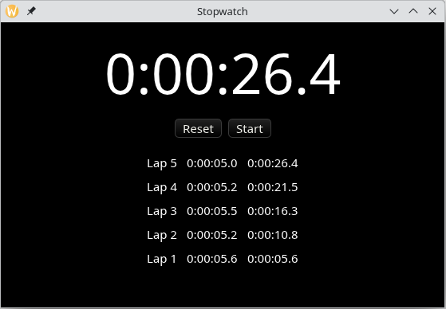
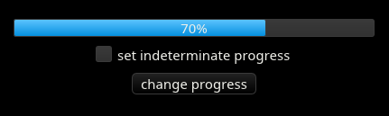
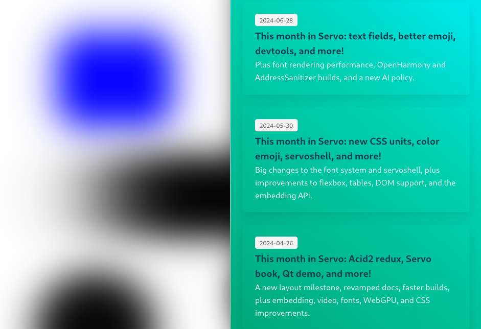

+++
title = "This Month in Xilem, August 2024"
authors = ["Daniel McNab"]
+++

Linebender is an informal open-source organization working on various projects to advance the state of the art in GUI for [the Rust programming language](https://rust-lang.org).

<figure>

<figcaption>

Linebender has a new logo, which was contributed by [Markus Siglreithmaier](https://github.com/msiglreith).
We're seeking feedback on Zulip in [#linebender>logo](https://xi.zulipchat.com/#narrow/stream/419691-linebender/topic/logo).

</figcaption>
</figure>

## Xilem

Xilem is our flagship GUI project, inspired by SwiftUI.

- We integrated basic animated variable font rendering ([xilem#507][]).
- Philipp Mildenberger moved us back to using `Viewmarker` in [xilem#472][].
  This restores the ability to return `ViewSequence`s, by making a tradeoff to work around Rust's faulty trait ambiguity rules.
- We added Views for some existing and new widgets:
  - spinners, useful for showing indetermine progress ([xilem#497][]);
  - progress bars ([xilem#513][]); and
  - the `Portal` widget, which brings support for scroll areas to Xilem ([xilem#561][]).
- Xilem Web:
    <!-- TODO: -->
  - One or two most impactful items.

<figure>

<figcaption>

Jared O'Connell additionally contributed a stopwatch example in [xilem#492][].

</figcaption>
</figure>

## Masonry

Masonry is the widget system used by Xilem.
This month has been dominated by Olivier's implementation of pass specification ([rfcs#7][]):

- [xilem#512][]: The new compose pass, which is used to minimise redraw when scrolling.
- [xilem#510][]: Adds the mutate pass, which allows later passes to assume the tree structure is stable by limiting when tree mutation can occur.
- [xilem#522][]: Implements paint and accessibility as passes, with follow-up by Tom Churchman in [xilem#557][].
- [xilem#488][] and [xilem#540]: updated event and pointer handling, and disabled handling respectively.
- In progress work includes layout in [xilem#529][], focus in [xilem#538][], animation in [xilem#539][] and scroll requests in [xilem#550][].

We also had some great community contributions, such as:

- Richard Dodd added a new progress Bar widget ([xilem#513][]).
- Fixes for Portal scrolling, by Tom Churchman ([xilem#563][]).

<figure>

<figcaption>

A progress bar widget was contributed by Richard Dodd in ([xilem#513][]).

</figcaption>
</figure>

We continue to make progress on other key features.

- Snapshot tests now are cross-platform and run in CI ([xilem#233][]).
- Pan/flick gestures are being developed in ([xilem#562][]).
- Progress continues on text input for Android. This has shifted into creating our own activity type, with better support for accessibility and text input than `NativeActivity`. <!-- TODO: links? - cc @xorgy -->
- Progress is continuing well on Accessibility for Android. You can try this in [xilem#575][]<!-- , or see it in the below video -->.

<!-- TODO: Accessibility video. Embed? -->

## Vello

Vello is our GPU vector renderer.
We have made some really great progress in August<!-- , TODO: and are actively planning a 0.3.0 release? -->.

- We now support blurred rounded rectangles, contributed by Markus Siglreithmaier ([vello#665][])
- Blend stack spilling was implementing, which allows blends more than four layers deep ([vello#661][]).
- Fixes for some visual artifacts in [vello#651][], [vello#659] and [vello#673][].
- Embedding existing wgpu textures is now supported ([vello#636][]).
- We now support bitmap glyphs (i.e. emoji), in addition to our previous COLR support ([vello#641][]).
- Work has begun on sparse strips, which is tracked in [vello#670][].
- Frame pacing for Android is being investigated and developed in [vello#674][].
- Thomas Smith has been doing some deep-dives into parallel scan, which is the core operation in Vello.
  This work can be found in [#gpu>Progress for GPU's Without Forward Progress Guarantees](https://xi.zulipchat.com/#narrow/stream/197075-gpu/topic/Progress.20for.20GPU's.20Without.20Forward.20Progress.20Guarantees).

<figure>

<figcaption>

Vello now supports blurred rounded rectangles, based on the maths      from [Raph's blog](https://raphlinus.github.io/graphics/2020/04/21/blurred-rounded-rects.html).
Left: Vello's blurred rounded rectangles test scene.
Right: [Blitz](https://github.com/DioxusLabs/blitz/)'s `servo` example which renders box shadows using this feature.

</figcaption>
</figure>

## Parley

Parley is a text layout library.

- Primitives required for robust text editing were added in [parley#106][].

## Others

- Bruce Mitchener has started work on Interpoli, a... <!-- TODO: Finish -->
- We have performed a [retrospective](@/blog/2024-08-24-roadmap-may-2024-retro.md) on our last roadmap.
- Daniel and Olivier's "office hours" appointments can still be booked by anyone for open-ended time-limited discussion of the ecosystem.
  - [See Daniel's schedule here](https://calendar.google.com/calendar/u/0/appointments/schedules/AcZssZ32eQYJ9DtZ_wJaYNtT36YioETiloZDIdImFpBFRo5-XsqGzpikgkg47LPsiHhpiwiQ1orOwwW2).
  - [See Olivier's schedule here](https://calendar.google.com/calendar/u/0/appointments/schedules/AcZssZ2t767ZRETD_TkRI_VxK2ZTG0VrO9OZ4l7HvTxefhtJcg85iK0ZN7zWNnAEZtH0Dn7C1GKxrmYM).

<!-- TODO: Add remaining links -->

[parley#106]: https://github.com/linebender/parley/pull/106
[rfcs#7]: https://github.com/linebender/rfcs/pull/7
[vello#636]: https://github.com/linebender/vello/pull/636
[vello#641]: https://github.com/linebender/vello/pull/641
[vello#651]: https://github.com/linebender/vello/pull/651
[vello#661]: https://github.com/linebender/vello/pull/661
[vello#665]: https://github.com/linebender/vello/pull/665
[vello#670]: https://github.com/linebender/vello/pull/670
[vello#673]: https://github.com/linebender/vello/pull/673
[vello#674]: https://github.com/linebender/vello/pull/674
[xilem#233]: https://github.com/linebender/xilem/pull/233
[xilem#472]: https://github.com/linebender/xilem/pull/472
[xilem#488]: https://github.com/linebender/xilem/pull/488
[xilem#492]: https://github.com/linebender/xilem/pull/492
[xilem#497]: https://github.com/linebender/xilem/pull/497
[xilem#507]: https://github.com/linebender/xilem/pull/507
[xilem#510]: https://github.com/linebender/xilem/pull/510
[xilem#512]: https://github.com/linebender/xilem/pull/512
[xilem#513]: https://github.com/linebender/xilem/pull/513
[xilem#522]: https://github.com/linebender/xilem/pull/522
[xilem#529]: https://github.com/linebender/xilem/pull/529
[xilem#538]: https://github.com/linebender/xilem/pull/538
[xilem#539]: https://github.com/linebender/xilem/pull/539
[xilem#550]: https://github.com/linebender/xilem/pull/550
[xilem#557]: https://github.com/linebender/xilem/pull/557
[xilem#561]: https://github.com/linebender/xilem/pull/561
[xilem#562]: https://github.com/linebender/xilem/pull/562
[xilem#563]: https://github.com/linebender/xilem/pull/563
[xilem#575]: https://github.com/linebender/xilem/pull/575
