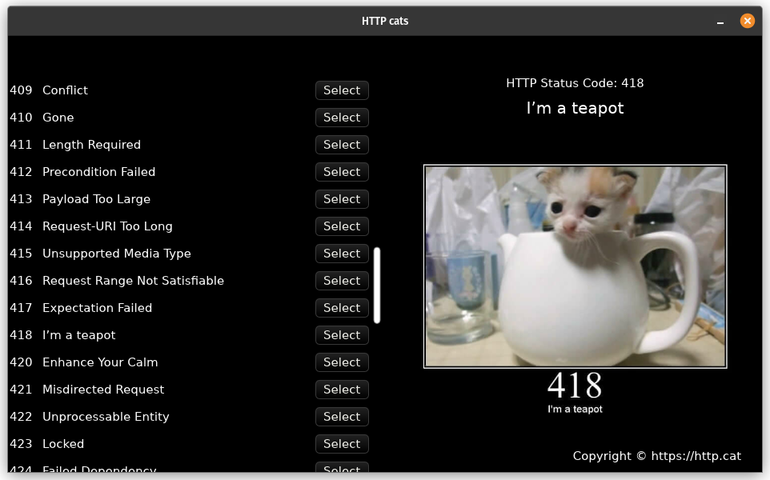

+++
title = "This Month in Linebender, September 2024"
authors = ["Daniel McNab", "Olivier Faure"]
+++

Linebender is an informal open-source organization working on various projects to advance the state of the art in GUI for [the Rust programming language](https://rust-lang.org).

## Xilem

Xilem is our flagship GUI project, inspired by SwiftUI.
It lets you build user interfaces declaratively by composing lightweight views together, and will diff them to provide minimal updates to a retained layer.

- HTTP cats example ([xilem#571][]).
- `lens`, a shorthand for a common component pattern ([xilem#587][]).
- We added Views for some existing and new widgets:
  - Grid layout ([xilem#570][]).
  - Images ([xilem#571][]).

<!-- TODO: Xilem Web seems to not have any especially relevant updates? -->

<figure>

<figcaption>

The HTTP cats example.

</figcaption>
</figure>

## Masonry

Masonry is the widget system used by Xilem.
It provides a non-opinionated retained widget tree, designed as a base layer for high-level GUI frameworks.

Our ongoing pass specification project has been largely implemented.
That work is now in a wrapping-up stage, which has allowed Olivier to work on improving the codebase's quality in general.
Some highlights of work from September:

- [xilem#515][]: Removes unimplemented functionality from our text handling code.
- [xilem#570][]: An implementation of a grid layout, by Jared O'Connell.
- [xilem#550][]: Restores scroll requests, as used by text inputs.
- [xilem#565][]: Allows widgets to implement more efficient pointer position dispatching, by new Linebender member Tom Churchman.
- [xilem#580][]: Adds screen reader support for the textbox widget.

<!-- No grid example, it's not really visual. -->

Some ongoing work includes:

- [xilem#615][]: Detailed accessibility information for text input and prose widgets.
- [xilem#606][]: Custom client side decorations for Wayland, by Marco Melorio.
- [xilem#605][]: Greater flexibility in the layout of the `Image` widget, by failingprovince.
- [xilem#591][]: An SVG-like widget for absolute positioning, by Muhammad Ragib Hasin.

## Vello

Vello is our GPU vector renderer.
It can draw large 2D scenes with high performance, using GPU compute shaders for most of the work.

The month of september included a lot of progress towards the 0.3.0 release.

- We no longer consider Vello to be experimental ([vello#691][]). Please note that Vello is still an alpha, and has several known issues.
- An implementation of the single pass scan described last month is being created by Thomas Smith in [vello#685][].

## Parley

Parley is a text layout library.
It handles text layout, mostly at the level of line breaking and resolving glyph positions.

- Nico Burns contributed a new way to assign layout properties in [parley#76][].

## Others

- Daniel and Olivier's "office hours" appointments can still be booked by anyone for open-ended discussion of the ecosystem.
  - [See Daniel's schedule here](https://calendar.google.com/calendar/u/0/appointments/schedules/AcZssZ32eQYJ9DtZ_wJaYNtT36YioETiloZDIdImFpBFRo5-XsqGzpikgkg47LPsiHhpiwiQ1orOwwW2).
  - [See Olivier's schedule here](https://calendar.google.com/calendar/u/0/appointments/schedules/AcZssZ2t767ZRETD_TkRI_VxK2ZTG0VrO9OZ4l7HvTxefhtJcg85iK0ZN7zWNnAEZtH0Dn7C1GKxrmYM).

[xilem#515]: https://github.com/linebender/xilem/pull/515
[xilem#550]: https://github.com/linebender/xilem/pull/550
[xilem#565]: https://github.com/linebender/xilem/pull/565
[xilem#570]: https://github.com/linebender/xilem/pull/570
[xilem#571]: https://github.com/linebender/xilem/pull/571
[xilem#580]: https://github.com/linebender/xilem/pull/580
[xilem#587]: https://github.com/linebender/xilem/pull/587
[xilem#591]: https://github.com/linebender/xilem/pull/591
[xilem#605]: https://github.com/linebender/xilem/pull/605
[xilem#606]: https://github.com/linebender/xilem/pull/606
[xilem#615]: https://github.com/linebender/xilem/pull/615
[vello#685]: https://github.com/linebender/vello/pull/685
[vello#691]: https://github.com/linebender/vello/pull/691
[parley#76]: https://github.com/linebender/parley/pull/76
