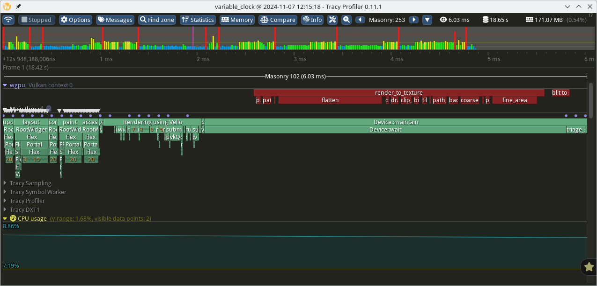
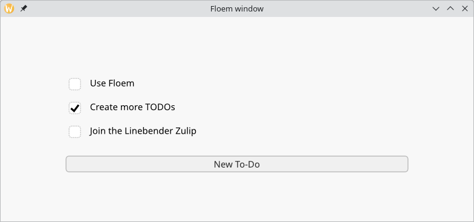

+++
title = "Linebender in October 2024: resvg stewardship"
authors = ["Bruce Mitchener", "Daniel McNab"]
+++

Linebender is an informal open-source organization working on various projects to advance the state of the art in GUI for [the Rust programming language](https://rust-lang.org).

This month's update is very significant, featuring several crate releases and the adoption of resvg.

## Resvg, Tiny-Skia, and Related Projects

We would like to thank [Yevhenii Reizner (RazrFalcon)](https://github.com/RazrFalcon) for all his work on resvg, tiny-skia, and related projects.
Due to some changes in his personal circumstances, he has to give up working on his collection of excellent crates and he has been seeking new homes for them to help keep the lights on.
The following projects are now part of Linebender:

- [resvg](https://github.com/linebender/resvg) - an SVG rendering library, including [usvg](https://crates.io/crates/usvg);
- [tiny-skia](https://github.com/linebender/tiny-skia) - a skia subset ported to Rust.

These crates are widely used within the ecosystem and play an important role in many software projects, and not just in Rust!
Given that Linebender has a mission to provide high quality libraries for GUI and we have established processes for managing those libraries, we feel well positioned to step in and help out.
Several associated repositories and projects are also now part of Linebender.
These are [simplecss](https://github.com/linebender/simplecss), [svgtypes](https://github.com/linebender/svgtypes), and [resvg-test-suite](https://github.com/linebender/resvg-test-suite).

We do not expect this change to significantly impact current users of `resvg`, `usvg`, or `tiny-skia`.
Our role is a stewardship role, to allow updates to continue as needed by the community.
If things work for you now, they will continue to work for you going forward.

Our plans for the near future are:

- Integrate with existing Linebender [practices for CI][rfcs#5], testing, and releases.
- Review and respond to incoming pull requests and issues.
- Re-license the `resvg` repository (including both `resvg` and `usvg`) from the MPL-2.0 license to a dual Apache 2.0 / MIT license as is common within the Rust world and the standard for Linebender projects.
- Provide new releases as needed, working with the community to bring additional maintainers.

In the longer term, we will look at how the ecosystem is evolving and what’s needed or useful.
The Linebender team has deep expertise in 2D rendering, including vector graphics, color and text layout, shaping, and rendering.
We look forward to seeing how we can apply this to these projects.

### Relicensing

We’ve already begun the process of re-licensing the `resvg` repository and are nearly done.
The change of license will be present in the next release, which will also be our first release under the Linebender umbrella.
This will allow us to share code between the Linebender crates more easily.

This process can be followed at [resvg#838][].

### Help Wanted

We welcome pull requests and issues.

Also, with RazrFalcon becoming less involved, we’re losing a key source of knowledge about the code itself as well as the philosophy behind it.
We look forward to hearing from people who use the various crates to understand how you use it, what you use it for, and what you’d like to see.

For further discussion, please use the [resvg channel on the Zulip](https://xi.zulipchat.com/#narrow/channel/465085-resvg).

---

Alongside the work on resvg, we have been continuing work on our existing projects.

## Xilem

Xilem is our flagship GUI project, inspired by SwiftUI.
It lets you build user interfaces declaratively by composing lightweight views together, and will diff them to provide minimal updates to a retained layer.

- [xilem#681][]: `View::rebuild` was updated to reflect the ability to use reborrowing.
- [xilem#669][]: The font weight for `label`s was exposed, by Marco Melorio.

Work on Xilem Web continues.

## Masonry

Masonry is the widget system used by Xilem.
It provides a non-opinionated retained widget tree, designed as a base layer for high-level GUI frameworks.

- [xilem#632][]: Starts a Masonry book, including a guide on creating a To-Do List app.
- [rfcs#7][]: The pass specification RFC has been fully implemented, and the RFC has been merged.
- [xilem#705][]: Moved methods for mutating widgets to free functions.
  - This decreases ergonomics in favour of increasing uniformity between Masonry and crates which create their own widgets.
  - This change is intended to improve rustdoc output, and the ergonomics should be restored once Rust has Arbitrary Self Types V2.
- [xilem#615][]: Our accessibility for text has been greatly improved, allowing by-character and by-word movement through accessibility tools.
- [xilem#660][]: `request_paint` has been removed in favour of a new `request_render`, so that accessibility updates are less likely to be missed.
- [xilem#718][], [xilem#720][]: restored the ability to embed Masonry in external projects by re-exported required items.
- [xilem#612][]: A built-in feature-gated integration with [Tracy](https://github.com/wolfpld/tracy).

Daniel also provided a talk to [GOSIM China 2024](https://china2024.gosim.org/) about Masonry.
The recording of this presentation is not yet available.

<figure>

<figcaption>

Masonry now has built-in support for tracing using Tracy, using the [tracing-tracy](https://crates.io/crates/tracing-tracy) crate.

</figcaption>
</figure>

## Vello

Vello is our GPU vector renderer.
It can draw large 2D scenes with high performance, using GPU compute shaders for most of the work.

The main update is the release of version [0.3.0](https://github.com/linebender/vello/releases/tag/v0.3.0).
This release includes previously discussed support for emoji and blurred rounded rectangles.
We also now no longer consider Vello to be experimental, and so would encourage you to try Vello for your projects.
Raph has been working on Sparse Strip Path rendering; progress can be followed [in the Zulip thread](https://xi.zulipchat.com/#narrow/channel/197075-gpu/topic/Sparse.20strip.20path.20rendering).

We do still have several known issues, but are not aware of any issues which would block wider adoption.

<figure>

<figcaption>

Vello is now supported as a renderer for the external [Floem](https://lap.dev/floem/) project, developed for the Lapce editor.
Note that Lapce does not currently itself use Vello.

</figcaption>
</figure>

## Parley

Parley is a text layout library.
It handles text layout, mostly at the level of line breaking and resolving glyph positions.

We released [Parley 0.2.0](https://github.com/linebender/parley/releases/tag/v0.2.0).
This includes:

- [parley#126][]: A new abstraction for text editing operations.
- [parley#129][]: Ergonomics improvements for style properties.
- [parley#76][]: A tree-style layout builder, useful for building up a text section (e.g. between elements).

We have also done some follow up work, including:

- [parley#143][]: Support for shortcutting drawing work if rendering has not changed.
- [parley#152][] (in progress): An example showing cursor blinking, by tannal.

## Piet

Piet is a 2d graphics library which abstracts over platform-native graphics APIs.
Linebender is focused on [Vello](#vello) rather than Piet for performance reasons, but some users may find Piet useful, as it relies on more mature renderers and is more compatible with older platforms.
During October, we released [Piet 0.7.0](https://github.com/linebender/piet/releases/tag/v0.7.0).

Some key updates from October included in this release are:

- [piet#572][]: Use of `Arc` over `Rc` for stroke dashing, by anesthetice.
- [piet#585][]: An update to the Rust 2018 edition, from Bruce Mitchener.
- [piet#578][]: Improved robustness of `copy_raw_pixels` on Direct2D by Kaur Kuut.
- Many dependency updates.

## Druid

Druid is a GUI library which was a predecessor to Xilem, and an ancestor of Masonry.

We are in the process of relicensing Druid from its current license of Apache 2.0 only to the Rust ecosystem standard Apache 2.0 OR MIT dual license.
If you have previously contributed to Druid, please read and respond to [druid#2414][].
This will greatly improve cross-compatibility will the rest of the Rust ecosystem, particularly for adapting code from Druid into newer toolkits.
We plan to archive the Druid repo after one more release, as we are not actively developing it; we are working to bring Xilem to parity in capability.
Will also apply this license change to Xilem and Masonry, as well as Glazier, which is currently archived.

## Others

- Daniel and Olivier's "office hours" appointments can still be booked by anyone for open-ended discussion of the ecosystem.
  - [See Daniel's schedule here](https://calendar.google.com/calendar/u/0/appointments/schedules/AcZssZ32eQYJ9DtZ_wJaYNtT36YioETiloZDIdImFpBFRo5-XsqGzpikgkg47LPsiHhpiwiQ1orOwwW2).
  - [See Olivier's schedule here](https://calendar.google.com/calendar/u/0/appointments/schedules/AcZssZ2t767ZRETD_TkRI_VxK2ZTG0VrO9OZ4l7HvTxefhtJcg85iK0ZN7zWNnAEZtH0Dn7C1GKxrmYM).

[druid#2414]: https://github.com/linebender/druid/pull/2414
[parley#126]: https://github.com/linebender/parley/pull/126
[parley#129]: https://github.com/linebender/parley/pull/129
[parley#143]: https://github.com/linebender/parley/pull/143
[parley#152]: https://github.com/linebender/parley/pull/152
[parley#76]: https://github.com/linebender/parley/pull/76
[piet#572]: https://github.com/linebender/piet/pull/572
[piet#578]: https://github.com/linebender/piet/pull/578
[piet#585]: https://github.com/linebender/piet/pull/585
[resvg#838]: https://github.com/linebender/resvg/pull/838
[rfcs#5]: https://github.com/linebender/rfcs/pull/5
[rfcs#7]: https://github.com/linebender/rfcs/pull/7
[xilem#612]: https://github.com/linebender/xilem/pull/612
[xilem#615]: https://github.com/linebender/xilem/pull/615
[xilem#632]: https://github.com/linebender/xilem/pull/632
[xilem#660]: https://github.com/linebender/xilem/pull/660
[xilem#669]: https://github.com/linebender/xilem/pull/669
[xilem#681]: https://github.com/linebender/xilem/pull/681
[xilem#705]: https://github.com/linebender/xilem/pull/705
[xilem#718]: https://github.com/linebender/xilem/pull/718
[xilem#720]: https://github.com/linebender/xilem/pull/720
