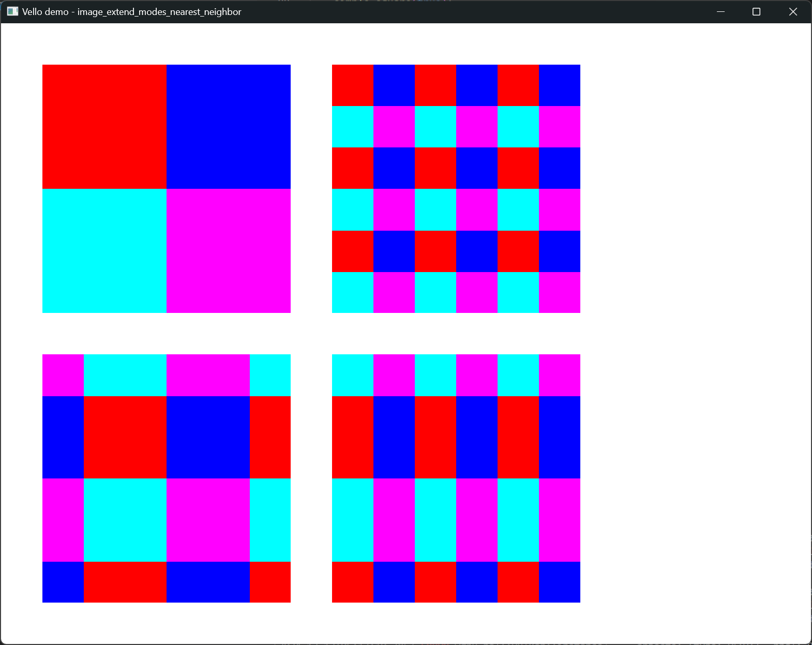

+++
title = "Linebender in January 2025"
authors = ["Kaur Kuut", "Daniel McNab", "Tom Churchman", "Raph Levien"]
+++

Linebender is an informal open-source organization working on various projects to advance the state of the art in GUI for [the Rust programming language](https://rust-lang.org).

## Xilem

Xilem is our flagship GUI project, inspired by SwiftUI.
It lets you build user interfaces declaratively by composing lightweight views together, and will diff them to provide minimal updates to a retained layer.

<!-- Docs contributed, pod flexibility, emoji picker landed,  -->

## Masonry

Masonry is the widget system used by Xilem.
It provides a non-opinionated retained widget tree, designed as a base layer for high-level GUI frameworks.

<!-- Docs, Box<dyn widget> cleanup, inspector, transforms, zstack -->

## Vello

Vello is our GPU vector renderer.
It can draw large 2D scenes with high performance, using GPU compute shaders for most of the work.

We released [Vello 0.4.0][] which has a bunch of improvements and fixes from the preceding four months.
Among the improvements is the change from December that Vello now uses our own [Color][] library.
Highlights from the additions in January include [image extend modes, alpha, and nearest neighbor sampling][vello#766] and [correct rendering of Apple Color Emoji][vello#792].

<figure>

<figcaption>
Vello demo, showing image extend modes with nearest neighbor filtering.
</figcaption>
</figure>

Of course work didn't stop with this release.
In preparation for the next release we have already [upgraded Vello to use wgpu 0.24.0][vello#791].
<!-- Screenshot of image extend modes -->

## Kurbo

Kurbo provides data structures and algorithms for curves and vector paths.

- [kurbo#409][]: Add `turn_90` and `rotate_scale` methods to `Vec2`, plus fix the docs of `Vec2::cross`.

## Parley

Parley is a text layout library.
It handles text layout, mostly at the level of line breaking and resolving glyph positions.

In January, a variety of layout edge cases have been fixed, support for bidirectional text was expanded, and testing of text layout and selection has improved.

- [parley#238][]: Updated to `swash` 0.2.0, which paves the way for future `no_std` support.
- [parley#239][]: Takes another step towards supporting `no_std` by enabling further testing in CI.
- [parley#241][]: Allows configuring the behavior of alignment for lines that overflow the container width.
- [parley#244][]: Adds screenshots to selection area and cursor positioning tests.
- [parley#245][]: Enables detection of the base direction of text layouts (left-to-right or right-to-left).
- [parley#249][]: Fixes issues related to line breaking around inline boxes, by new Linebender member Wim de With.
- [parley#254][]: Follows the [CSS white space model][] in stripping leading white space following a new line in white space collapsing mode.
- [parley#256][]: Corrects the calculation of trailing white space, also by Wim de With.

## Peniko

Peniko provides a set of shared types for concepts that are important for drawing/stroking paths, but excluding the path geometry itself (which can be found in Kurbo).
It includes types for brush styles (including gradient) and color.

We released [Peniko 0.3.1][] which was a simple maintenance release with tweaked docs and updated dependencies.

## Color

[Color][] provides functionality for representing, converting, parsing, serializing, and manipulating colors in a variety of color spaces.
It closely follows the [CSS Color Module Level 4][] draft spec.

We released [Color 0.2.2][], soon followed by [Color 0.2.3][], the latter of which added easier methods to convert 8-bit colors from byte streams (for use with GPUs) and to other color representations in [color#135][] and [color#136][].
This release also saw the addition of the ACES2065-1 color space in [color#124][].

## Velato

- [velato#49][]: Updated to `vello` 0.4.0.

## Vello SVG

We released [Vello SVG 0.6.0][] which most notably includes:
- [vello_svg#50][]: Support for raster images to be completely disabled via a feature flag.
- [vello_svg#53][]: Updated to `vello` 0.4.0.

## Kompari

[Kompari][] is a tool for visual inspection of snapshot tests.

- [kompari#13][]: Interactive review (in HTML).
- [kompari#14][]: Rework of repository layout.
- [kompari#16][]: Alternative diff views.

## Resvg

- [resvg#873][]: Added the stylesheet option to the C API.
- [resvg#878][]: Updated to `svgtypes` 0.15.3.

## SVG Types

We released [SVG Types 0.15.3][] with a few minor fixes.
This is also the first release under the stewardship of Linebender.

## Tiny Skia

- [tiny-skia#146][]: Add `scale_by`/`scale_to` functions to `Size`.

## SimpleCSS

We released [SimpleCSS 0.2.2][] with `no_std` support, updated docs clarifying Linebender involvement, and to test run the publishing workflow.

## Research and Future Directions

Linebender has an origin story in being a very research oriented group, looking to break new ground.
While we are focused on shipping code today, we still have an eye on the future and how to be prepared for the new opportunities and technologies that are coming.

While Vello has unmatched rendering speed thanks to its GPU-driven architecture, there are two practical tradeoffs: it can require unpredictable amounts of memory, and it doesn't work on downlevel GPUs with weak or nonexistent support for compute shaders.
Raph Levien has been exploring a possible hybrid CPU/GPU direction for Vello to address these issues.
Read the [design doc][Potato design doc], follow the [Zulip thread][Potato zulip thread], or stay tuned for more developments.

## Get Involved

We welcome collaboration on any of our crates.
This can include improving the documentation, implementing new features, improving our test coverage, or using them within your own code.

We host an hour long office hours meeting each week where we discuss what's going on in our projects.
See [#office hours in Zulip](https://xi.zulipchat.com/#narrow/channel/359642-office-hours) for details.

* Daniel and Olivier's "office hours" appointments can still be booked by anyone for open-ended discussion of the ecosystem.
  * [See Daniel's schedule here](https://calendar.google.com/calendar/u/0/appointments/schedules/AcZssZ32eQYJ9DtZ_wJaYNtT36YioETiloZDIdImFpBFRo5-XsqGzpikgkg47LPsiHhpiwiQ1orOwwW2).
  * [See Olivier's schedule here](https://calendar.google.com/calendar/u/0/appointments/schedules/AcZssZ2t767ZRETD_TkRI_VxK2ZTG0VrO9OZ4l7HvTxefhtJcg85iK0ZN7zWNnAEZtH0Dn7C1GKxrmYM).

[Vello 0.4.0]: https://github.com/linebender/vello/releases/tag/v0.4.0
[vello#766]: https://github.com/linebender/vello/pull/766
[vello#791]: https://github.com/linebender/vello/pull/791
[vello#792]: https://github.com/linebender/vello/pull/792

[kurbo#409]: https://github.com/linebender/kurbo/pull/409

[parley#238]: https://github.com/linebender/parley/pull/238
[parley#239]: https://github.com/linebender/parley/pull/239
[parley#241]: https://github.com/linebender/parley/pull/241
[parley#244]: https://github.com/linebender/parley/pull/244
[parley#245]: https://github.com/linebender/parley/pull/245
[parley#249]: https://github.com/linebender/parley/pull/249
[parley#254]: https://github.com/linebender/parley/pull/254
[parley#256]: https://github.com/linebender/parley/pull/256
[CSS white space model]: https://www.w3.org/TR/CSS2/text.html#white-space-model

[Peniko 0.3.1]: https://github.com/linebender/peniko/releases/tag/v0.3.1

[Color]: https://docs.rs/color/
[CSS Color Module Level 4]: https://www.w3.org/TR/css-color-4/
[Color 0.2.2]: https://github.com/linebender/color/releases/tag/v0.2.2
[Color 0.2.3]: https://github.com/linebender/color/releases/tag/v0.2.3
[color#124]: https://github.com/linebender/color/pull/124
[color#135]: https://github.com/linebender/color/pull/135
[color#136]: https://github.com/linebender/color/pull/136

[velato#49]: https://github.com/linebender/velato/pull/49

[Vello SVG 0.6.0]: https://github.com/linebender/vello_svg/releases/tag/v0.6.0
[vello_svg#50]: https://github.com/linebender/vello_svg/pull/50
[vello_svg#53]: https://github.com/linebender/vello_svg/pull/53

[Kompari]: https://github.com/linebender/kompari
[kompari#13]: https://github.com/linebender/kompari/pull/13
[kompari#14]: https://github.com/linebender/kompari/pull/14
[kompari#16]: https://github.com/linebender/kompari/pull/16

[resvg#873]: https://github.com/linebender/resvg/pull/873
[resvg#878]: https://github.com/linebender/resvg/pull/878

[SVG Types 0.15.3]: https://github.com/linebender/svgtypes/releases/tag/v0.15.3

[tiny-skia#146]: https://github.com/linebender/tiny-skia/pull/146

[SimpleCSS 0.2.2]: https://github.com/linebender/simplecss/releases/tag/v0.2.2

[Potato design doc]: https://docs.google.com/document/d/1gEqf7ehTzd89Djf_VpkL0B_Fb15e0w5fuv_UzyacAPU/edit?usp=sharing
[Potato zulip thread]: https://xi.zulipchat.com/#narrow/channel/197075-gpu/topic/Potato.20-.20a.20paper.20design.20for.20a.20CPU.2FGPU.20hybrid.20renderer
