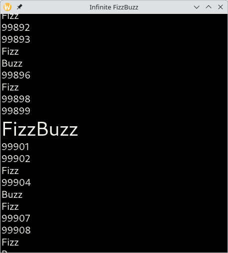
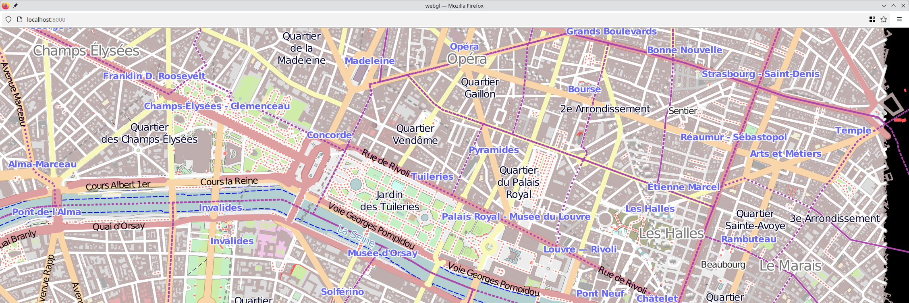
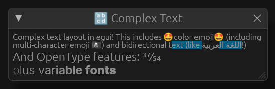

+++
title = "Linebender in March 2025"
authors = ["Daniel McNab", "Bruce Mitchener", "Raph Levien"]
+++

Linebender is an informal open-source organization working on various projects to advance the state of the art in GUI for [the Rust programming language](https://rust-lang.org).

## Masonry

Masonry is the widget system developed by Linebender.
It provides a non-opinionated retained widget tree, designed as a base layer for high-level GUI frameworks.

We have made a major change to the internal design of Masonry, in [xilem#910][] and [xilem#914][].
This change splits Masonry into two packages, `masonry_core` and `masonry`.
The Masonry crate provides a runner for Masonry core using Winit, and should be used for an integrated app development experience.
Masonry Core contains the implementation of Masonry's widgets and passes, and is designed to be be embedded into existing apps (currently only those which use wgpu).
This should be transparent to existing Masonry users.

We hoped to release a new alpha of Xilem and Masonry to crates.io in March.
However, this was put on hold whilst the Properties experiment we mentioned last month continues:

- [xilem#873][]: Implements properties, which is additional data attached to each widget in a uniform way, intended to enable styling.
- [xilem#892][]: Uses properties for styling the built-in `Button` widget.

<figure>

<figcaption>

An example of a styled button.

</figcaption>
</figure>

We have also made significant progress outside of these highlighted areas:

- [xilem#897][]: Reduced the size of many of our screenshot tests.
- [xilem#904][]: Implemented a new algorithm for screenshot testing, which better reflects the aspects of the screenshots we wish to test.
  It also implements automatic compression of blessed screenshots using the excellent [oxipng][] library.
- [xilem#899][]: Added documentation for lots of items and methods which were missing documentation.
- [xilem#882][]: Adds the core of a virtual scrolling widget, a scroll area which loads its child widgets only when they would be visible to the user.
  This allows it to be used for extremely large datasets.

<figure>

<figcaption>

[xilem#882][] added a virtual scrolling widget. This is the 'Infinite FizzBuzz' example, which also shows how the virtual scrolling can support items with arbitrary heights.

</figcaption>
</figure>

## Xilem

Xilem is our flagship GUI project, inspired by SwiftUI, which uses Masonry for its widgets.
It lets you build user interfaces declaratively by composing lightweight views together, and will diff them to provide minimal updates to a retained layer.

- [xilem#887][]: Added a View for the already existing Split widget.
- [xilem#899][]: Added some more documentation.

## Vello

Vello is our GPU vector renderer.
It can draw large 2D scenes with high performance, using GPU compute shaders for most of the work.

- [vello#841][]: Fixed incorrect COLR Emoi rendering, which especially impacted users on Windows.
  We backported this to create [Vello 0.4.1](https://github.com/linebender/vello/releases/tag/v0.4.1).
- [vello#817][], [vello#877][]: Updates some of our GPU encoding code to not assume that allocators will give over-aligned allocations.

We have also renamed the #gpu channel on Zulip to [#vello](https://xi.zulipchat.com/#narrow/channel/197075-vello), which better reflects the purpose of the channel.
Progress on the sparse strips renderer has also been continuing at pace:

- [vello#827][]: Added some core API types.
- [vello#828][]: Imported the implementation of sparse strip production, without rasterisation (Vello Common).
- [vello#830][], [vello#832][]: Added on CPU rasterisation of sparse strips, with integration tests (Vello CPU).
- [vello#834][]: Added a tool (Vello Toy) for visualising different stages of the new pipeline.
- [vello#831][]: Added the fragment shader based GPU rasteriser for sparse strips (Vello Hybrid).
- [vello#872][]: Enable running Vello Hybrid using WebGL2.
- [vello#867][]: Benchmarking harness for Vello Common and Vello CPU.

<figure>

<figcaption>

Paris-30k rendered using Vello's new hybrid renderer in Firefox on Linux, a browser which does not yet support WebGPU.

</figcaption>
</figure>

The current state of the sparse strip renderers is that they can reliably render scenes where all elements are a solid colour.
Laurenz Stampfl started their master's project working on the CPU-only renderer full-time at the end of March, working towards this roadmap and on a write-up.
The planned ordering of next steps is laid out in [our loose roadmap](https://docs.google.com/document/d/1L0Ji44GiFMygK_6h6_TP0Id8ghTMxUirgrM_5nb5zyQ/edit?tab=t.0#heading=h.atiojofshbyp).
You can also follow the progress in [#vello > Vello Hybrid](https://xi.zulipchat.com/#narrow/channel/197075-vello/topic/Vello.20Hybrid) and other threads in [#vello](https://xi.zulipchat.com/#narrow/channel/197075-vello).
Our weekly renderer office hours specifically aimed at furthering this collaboration are public - for more information about how to join these, follow [#office hours](https://xi.zulipchat.com/#narrow/channel/359642-office-hours).
Work on the renderers is continuing at pace, most recently in these open PRs:

- [vello#878][]: Add clipping to Vello CPU.
- [vello#883][]: Implements text/glyph rendering.
- [vello#879][]: Experimentally runs Vello Hybrid on Android, using the new Android View work, discussed [below](#research-and-future-directions).

## Parley

Parley is a text layout library.
It handles text layout, mostly at the level of line breaking and resolving glyph positions.
The biggest news in March was that an egui community member has opened [a PR][egui#5784] to replace egui's bespoke text handling with Parley, with buy-in from egui's maintainer.
The author of that change, valadaptive, has been doing fantastic work improving Parley, and has authored many of these changes.

- [parley#306][]: Updated `register_fonts` to take a `Blob`, which allows more efficient memory usage.
- [parley#312][]: Allows customising how registered fonts are matched, useful for implementing web fonts.
- [parley#296][]: Makes selected newline characters visible.
- [parley#316][], [parley#317][]: Provides greater access to the internals of `PlainEditor`.
- [parley#318][]: `is_done` method on `BreakLines`, for detecting whether linebreaking is finished.
- [parley#299][]: Fixed text editing for layouts containing inline boxes.

<figure>

<figcaption>

[egui#5784][] significantly improves egui's text rendering by using Parley.

</figcaption>
</figure>

## Kurbo

Kurbo provides data structures and algorithms for curves and vector paths.

- [kurbo#427][]: First cut at least-squares offset curves.
- [kurbo#428][]: Improve performance of debug builds by more aggressively enabling inlining.
- [kurbo#429][]: Add `Affine::scale_about`. This makes implementing zoom in a user interface more concise.

One of the core features in kurbo is expanding a stroked outline to a filled path, which is based on computing accurate approximations to offset curves, a difficult problem in computational geometry.
As tracked in [kurbo#317][], our existing solution, based on quartic solving, produced good results but was slow.
We've been doing research into much faster techniques based on least-squares error minimization and accelerated Newton techniques, and [kurbo#427][] is the first step in landing that work.
Over the coming months, we plan to refine robustness and performance of the stroke expansion algorithm, and will also explore generalizing it to variable width strokes, an often-requested feature.

## Color

[Color][] provides functionality for representing, converting, parsing, serializing, and manipulating colors in a variety of color spaces.
It closely follows the [CSS Color Module Level 4][] draft spec.

- [color#144][]: Improves correctness when interpolating a color with missing components in the ACES 2065-1 colorspace.

## Kompari

[Kompari][] is a tool for visual inspection of snapshot tests.

- [kompari#26][]: Added support for optimising screenshots using `oxipng`.
- [kompari#27][]: Support detecting unoptimised screenshots (useful for CI).
- [kompari#34][]: Added parallel processing of compute intensive tasks.

## Research and Future Directions

Linebender has an origin story in being a very research oriented group, looking to break new ground.
While we are focused on shipping code today, we still have an eye on the future and how to be prepared for the new opportunities and technologies that are coming.

Matt Campbell has started work on a new platform integration for Rust code in Android, called [Android View](https://github.com/mwcampbell/android-view).
This is designed to work around several issues from  the activities available when using Winit, which use either `NativeActivity` or `GameActivity`.
Both of these do not integrate well with text input, and struggle to interoperate inside existing apps.
This work is in an early stage, and is taking inspiration from several existing solutions to these problems, with a special focus on getting accessibility integration correct.

We have also started work on a [Styled Text](https://github.com/linebender/styled_text) library, which is designed to allow sharing rich text functionality between Rust libraries.
This is in the very early stages - if you're working on a project which can use this, then input on your requirements will be welcome.

## RustWeek

Many members of the Linebender community will be attending the [RustWeek 2025](https://rustweek.org/) conference, in Utrecht in May.
At the time of writing, there are still tickets available.
Raph Levien will be giving a talk, titled [*Faster, easier 2D vector rendering*](https://rustweek.org/talks/raph/).
This will be covering a lot of the sparse strips work discussed in [the Vello section](#vello).

Matt Campbell will give a talk, titled [*AccessKit: reusable UI accessibility*](https://rustweek.org/talks/matt/).

## Get Involved

We welcome collaboration on any of our crates.
This can include improving the documentation, implementing new features, improving our test coverage, or using them within your own code.

We host an hour long office hours meeting each week where we discuss what's going on in our projects.
See [#office hours in Zulip](https://xi.zulipchat.com/#narrow/channel/359642-office-hours) for details.
We've also started a separate office hours time dedicated to the renderer collaboration, details also available at that link.

- Daniel and Olivier's "office hours" appointments can still be booked by anyone for open-ended discussion of the ecosystem.
  - [See Daniel's schedule here](https://calendar.google.com/calendar/u/0/appointments/schedules/AcZssZ32eQYJ9DtZ_wJaYNtT36YioETiloZDIdImFpBFRo5-XsqGzpikgkg47LPsiHhpiwiQ1orOwwW2).
  - [See Olivier's schedule here](https://calendar.google.com/calendar/u/0/appointments/schedules/AcZssZ2t767ZRETD_TkRI_VxK2ZTG0VrO9OZ4l7HvTxefhtJcg85iK0ZN7zWNnAEZtH0Dn7C1GKxrmYM).

[Color]: https://docs.rs/color/
[CSS Color Module Level 4]: https://www.w3.org/TR/css-color-4/

[Kompari]: https://github.com/linebender/kompari
[oxipng]: https://github.com/shssoichiro/oxipng

[color#144]: https://github.com/linebender/color/pull/144
[egui#5784]: https://github.com/emilk/egui/pull/5784
[kompari#26]: https://github.com/linebender/kompari/pull/26
[kompari#27]: https://github.com/linebender/kompari/pull/27
[kompari#34]: https://github.com/linebender/kompari/pull/34
[kurbo#317]: https://github.com/linebender/kurbo/issues/317
[kurbo#427]: https://github.com/linebender/kurbo/pull/427
[kurbo#428]: https://github.com/linebender/kurbo/pull/428
[kurbo#429]: https://github.com/linebender/kurbo/pull/429
[parley#296]: https://github.com/linebender/parley/pull/296
[parley#299]: https://github.com/linebender/parley/pull/299
[parley#306]: https://github.com/linebender/parley/pull/306
[parley#312]: https://github.com/linebender/parley/pull/312
[parley#316]: https://github.com/linebender/parley/pull/316
[parley#317]: https://github.com/linebender/parley/pull/317
[parley#318]: https://github.com/linebender/parley/pull/318
[vello#817]: https://github.com/linebender/vello/pull/817
[vello#827]: https://github.com/linebender/vello/pull/827
[vello#828]: https://github.com/linebender/vello/pull/828
[vello#830]: https://github.com/linebender/vello/pull/830
[vello#831]: https://github.com/linebender/vello/pull/831
[vello#832]: https://github.com/linebender/vello/pull/832
[vello#834]: https://github.com/linebender/vello/pull/834
[vello#841]: https://github.com/linebender/vello/pull/841
[vello#867]: https://github.com/linebender/vello/pull/867
[vello#872]: https://github.com/linebender/vello/pull/872
[vello#877]: https://github.com/linebender/vello/pull/877
[vello#878]: https://github.com/linebender/vello/pull/878
[vello#879]: https://github.com/linebender/vello/pull/879
[vello#883]: https://github.com/linebender/vello/pull/883
[xilem#873]: https://github.com/linebender/xilem/pull/873
[xilem#882]: https://github.com/linebender/xilem/pull/882
[xilem#887]: https://github.com/linebender/xilem/pull/887
[xilem#892]: https://github.com/linebender/xilem/pull/892
[xilem#897]: https://github.com/linebender/xilem/pull/897
[xilem#899]: https://github.com/linebender/xilem/pull/899
[xilem#904]: https://github.com/linebender/xilem/pull/904
[xilem#910]: https://github.com/linebender/xilem/pull/910
[xilem#914]: https://github.com/linebender/xilem/pull/914
