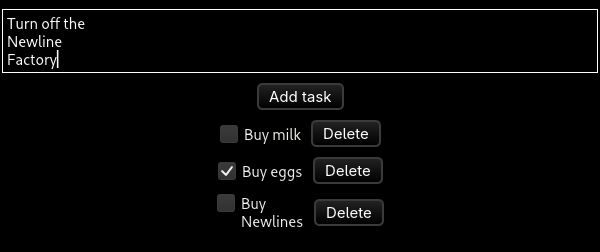
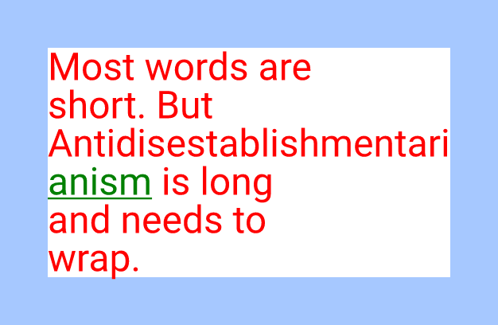
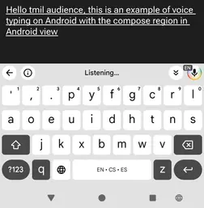

+++
title = "Linebender in April 2025"
authors = ["Daniel McNab", "Taj Pereira", "Tom Churchman"]
+++

Linebender is an informal open-source organization working on various projects to advance the state of the art in GUI for [the Rust programming language](https://rust-lang.org).

## RustWeek

Many members of the Linebender community will be attending the [RustWeek 2025](https://rustweek.org/) conference, in Utrecht next month.
At the time of writing, there are no longer tickets available, although there is a waitlist.
Raph Levien will be giving a talk, titled [*Faster, easier 2D vector rendering*](https://rustweek.org/talks/raph/).
This will be covering a lot of the sparse strips work discussed in [the Vello section](#vello).

Matt Campbell will give a talk, titled [*AccessKit: reusable UI accessibility*](https://rustweek.org/talks/matt/).

We will also be attending the [unconference](https://rustweek.org/unconf-intro/), as part of the "UI, App dev & Browser Summit" group.
We're looking forward to working with other teams in the Rust UI ecosystem there.

## Masonry

Masonry is the widget system developed by Linebender.
It provides a non-opinionated retained widget tree, designed as a base layer for high-level GUI frameworks.

- [xilem#913][], [xilem#938][]: Ongoing work on properties, in preparation for adding more styling options.
- [xilem#906][]: Improves Virtual Scrolling to support non-infinite use cases.
- [xilem#922][]: Adds support for multiline text input, by alexjg.
- [xilem#925][], [xilem#927][]: Update "line" scrolling to have a more correct speed, by Aaron Muir Hamilton and Alix Bott.
- [xilem#929][]: Used trait upcasting to simplify how widgets use `Any`.
- [xilem#937][]: Unifies test screenshots into a single folder, making it clearer which widget they relate to.

<figure>

<figcaption>

Masonry now has support for multi-line text inputs.

</figcaption>
</figure>

## Xilem

Xilem is our flagship GUI project, inspired by SwiftUI, which uses Masonry for its widgets.
It lets you build user interfaces declaratively by composing lightweight views together, and will diff them to provide minimal updates to a retained layer.

- [xilem#920][]: Slightly improves the handling of messages, using trait upcasting.
- [xilem#921][]: Supports Masonry's virtual scrolling in Xilem.

## Vello

Vello is our GPU vector renderer.
It can draw large 2D scenes with high performance, using GPU compute shaders for most of the work.

- [vello#886][], [vello#887][]: Update the SDL2 example to SDL3.
- [vello#892][]: Improved how our snapshot tests are handled in preparation for Kompari integration.

Progress on the sparse strips renderers has also been continuing at pace.
The big standout this month is the significant leap in Vello CPU functionality:

- [vello#923][]: Blending, compositing, and layers.
- [vello#893][]: Linear, radial and sweep gradients.
- [vello#878][]: Clipping.
- [vello#919][]: Image rendering.

<figure>

<figcaption>

An adapted version of Vello CPU's tests, showing support for blending, gradients and image rendering.

</figcaption>
</figure>

The above PRs set the foundation for introducing these features into Vello Hybrid over the coming months.
Another notable released feature is text outline rendering, which allows both renderers to draw text (emoji are not yet supported).

- [vello#883][]: Text outline rendering for Vello CPU and Hybrid.
- [vello#896][], [vello#897][]: Make the hinting robust, allowing clearer drawing in more cases.

Our working roadmap can be found [here](https://docs.google.com/document/d/1ZquH-53j2OedTbgEKCJBKTh4WLE11UveM10mNdnVARY/edit?tab=t.0#heading=h.j3duh9pgdm94).
This roadmap outlines our planned timeline for work on the renderers over the next year.

## Parley

Parley is a text layout library.
It handles text layout, mostly at the level of line breaking and resolving glyph positions.

- [parley#272][]: Added Kompari integration for testing into Parley.
- [parley#315][]: Implemented properties based on CSS's `word-break` and `overflow-wrap`.
- [parley#342][]: Fixes a bug in `align` where the offset wasn't being reset between calls.

<figure>

<figcaption>

[parley#315][] added the `WordBreak` style property, which is set to `BreakAll` on 'anism' in this screenshot.

</figcaption>
</figure>

## Kurbo

[Kurbo][] provides data structures and algorithms for curves and vector paths.

We released [Kurbo 0.11.2][], adding the [`Triangle`][kurbo-triangle] shape, providing more ergomic methods on various shapes, and improving performance.
The following are some highlights of this release.
See the [changelog][Kurbo 0.11.2] for a full overview.

- [kurbo#350][]: Adds the [`Triangle`][kurbo-triangle] shape.
- [kurbo#383][]: Adds an efficient numerical method for approximating ellipse perimeters, originally described by Kummer (1837) and rediscovered by Linderholm and Segal (1995).
- [kurbo#418][]: Adds `BezPath::with_capacity` to allow more efficient allocation if the size of the bezier path is known beforehand.
- [kurbo#379][]: Adds some common derives to `Stroke` and `StrokeOpts`.
- [kurbo#384][]: Implements `Div<f64>` and `Mul<f64>` for `Insets`.
- [kurbo#399][], [kurbo#409][]: Implement `Sum` for `Vec2`, add `Vec2::turn_90` and `Vec2::rotate_scale`.
- [kurbo#412][], [kurbo#413][]: Add `Size::{min,max}` and `Size::INFINITY`.
- [kurbo#429][]: Adds `Affine::scale_about` and `Affine::then_scale_about`.
- [kurbo#390][], [kurbo#428][]: Improve performance by reducing the number of operations in `Triangle::circumscribed_circle` and improving inlining.

Multiple improvements to Kurbo are on the roadmap, such as improved stroke expansion in [kurbo#427][].

## Color

[Color][] provides functionality for representing, converting, parsing, serializing, and manipulating colors in a variety of color spaces.
It closely follows the [CSS Color Module Level 4][] draft spec.

We released [Color 0.3.0][], featuring the addition of manual chromatic adaptation and absolute color conversions, improved type conversion ergonomics, and more.
This month saw the following changes, all included in the 0.3.0 release.
See the [changelog][Color 0.3.0] for a full overview.

- [color#156][], [color#164][], [color#165][]: Add specialized absolute color conversion methods for ProPhoto RGB, ACES2065-1 and ACEScg.
  While `ColorSpace` includes default implementations for absolute color conversions, having these specializations improves computational efficiency.
- [color#166][]: Uses faster (and [almost-correct][color-alphacolor-to-rgba8]) rounding for conversion from double precision floating point to 8-bit integer RGBA formats.
  This works around slow x86 rounding behavior.
- [color#155][]: Improves ergonomics by implementing `From<AlphaColor<_>> for DynamicColor` for all color spaces that have a `DynamicColor` counterpart.
- [color#157][]: Removes the deprecated `From<Rgba8> for PremulColor<Srgb>` implementation.
- [color#145][]: Fixes handling of powerless/missing components of the HWB color space, which is necessary for correct color interpolation when components are missing.
- [color#158][], [color#159][]: Improve documentation for `DynamicColor::interpolate` and `gradient`, including usage examples.
- [color#149][], [color#150][]: Improve constructing constant `Missing` flags and `Missing` documentation.

## Android View

[Android View](https://github.com/mwcampbell/android-view) is a platform integration for Rust code in Android apps.
In April, Android View gained support for text input using the software keyboard, with accessibility support.

<figure>

<figcaption>

Android View now allows many input methods on Android.
This screenshot shows voice to text working in an app using Linebender libraries.
This image has been edited to remove blank areas.

</figcaption>
</figure>

## Research and Future Directions

Linebender has an origin story in being a very research oriented group, looking to break new ground.
While we are focused on shipping code today, we still have an eye on the future and how to be prepared for the new opportunities and technologies that are coming.

Towards the end of April, some members of Linebender started working on ecosystem standardisation of input events, based on the web input events specification.
This work is happening in the [UI Events](https://github.com/endoli/ui-events) repository.
This is not a Linebender project, but we're watching it with great interest.

We've also started thinking about how to make a renderer abstraction, allowing APIs which can use any of Vello's backends.
The largest difficulty there is related to resources such as images.
For example Vello Hybrid's image type would be a `wgpu` Texture, whereas Vello CPU should just use a heap-allocated buffer.
We have some existing prototypes, see [#vello > Rendering abstraction prototype](https://xi.zulipchat.com/#narrow/channel/197075-vello/topic/Rendering.20abstraction.20prototype/with/516197002) for example.
This work is likely to now continue after RustWeek.

## Get Involved

We welcome collaboration on any of our crates.
This can include improving the documentation, implementing new features, improving our test coverage, or using them within your own code.

We host an hour long office hours meeting each week where we discuss what's going on in our projects.
See [#office hours in Zulip](https://xi.zulipchat.com/#narrow/channel/359642-office-hours) for details.
We've also started a separate office hours time dedicated to the renderer collaboration, details also available at that link.

- Daniel and Olivier's "office hours" appointments can still be booked by anyone for open-ended discussion of the ecosystem.
  - [See Daniel's schedule here](https://calendar.google.com/calendar/u/0/appointments/schedules/AcZssZ32eQYJ9DtZ_wJaYNtT36YioETiloZDIdImFpBFRo5-XsqGzpikgkg47LPsiHhpiwiQ1orOwwW2).
  - [See Olivier's schedule here](https://calendar.google.com/calendar/u/0/appointments/schedules/AcZssZ2t767ZRETD_TkRI_VxK2ZTG0VrO9OZ4l7HvTxefhtJcg85iK0ZN7zWNnAEZtH0Dn7C1GKxrmYM).

[Kurbo]: https://docs.rs/kurbo/
[kurbo-triangle]: https://docs.rs/kurbo/0.11.2/kurbo/struct.Triangle.html

[Kurbo 0.11.2]: https://github.com/linebender/kurbo/releases/tag/v0.11.2

[Color]: https://docs.rs/color/
[CSS Color Module Level 4]: https://www.w3.org/TR/css-color-4/
[color-alphacolor-to-rgba8]: https://docs.rs/color/0.3.0/color/struct.AlphaColor.html#method.to_rgba8

[Color 0.3.0]: https://github.com/linebender/color/releases/tag/v0.3.0

[color#145]: https://github.com/linebender/color/pull/145
[color#149]: https://github.com/linebender/color/pull/149
[color#150]: https://github.com/linebender/color/pull/150
[color#155]: https://github.com/linebender/color/pull/155
[color#156]: https://github.com/linebender/color/pull/156
[color#157]: https://github.com/linebender/color/pull/157
[color#158]: https://github.com/linebender/color/pull/158
[color#159]: https://github.com/linebender/color/pull/159
[color#164]: https://github.com/linebender/color/pull/164
[color#165]: https://github.com/linebender/color/pull/165
[color#166]: https://github.com/linebender/color/pull/166
[kurbo#350]: https://github.com/linebender/kurbo/pull/350
[kurbo#379]: https://github.com/linebender/kurbo/pull/379
[kurbo#383]: https://github.com/linebender/kurbo/pull/383
[kurbo#384]: https://github.com/linebender/kurbo/pull/384
[kurbo#390]: https://github.com/linebender/kurbo/pull/390
[kurbo#399]: https://github.com/linebender/kurbo/pull/399
[kurbo#409]: https://github.com/linebender/kurbo/pull/409
[kurbo#412]: https://github.com/linebender/kurbo/pull/412
[kurbo#413]: https://github.com/linebender/kurbo/pull/413
[kurbo#418]: https://github.com/linebender/kurbo/pull/418
[kurbo#427]: https://github.com/linebender/kurbo/pull/427
[kurbo#428]: https://github.com/linebender/kurbo/pull/428
[kurbo#429]: https://github.com/linebender/kurbo/pull/429
[parley#272]: https://github.com/linebender/parley/pull/272
[parley#315]: https://github.com/linebender/parley/pull/315
[parley#342]: https://github.com/linebender/parley/pull/342
[vello#878]: https://github.com/linebender/vello/pull/878
[vello#883]: https://github.com/linebender/vello/pull/883
[vello#886]: https://github.com/linebender/vello/pull/886
[vello#887]: https://github.com/linebender/vello/pull/887
[vello#892]: https://github.com/linebender/vello/pull/892
[vello#893]: https://github.com/linebender/vello/pull/893
[vello#896]: https://github.com/linebender/vello/pull/896
[vello#897]: https://github.com/linebender/vello/pull/897
[vello#919]: https://github.com/linebender/vello/pull/919
[vello#923]: https://github.com/linebender/vello/pull/923
[xilem#906]: https://github.com/linebender/xilem/pull/906
[xilem#913]: https://github.com/linebender/xilem/pull/913
[xilem#920]: https://github.com/linebender/xilem/pull/920
[xilem#921]: https://github.com/linebender/xilem/pull/921
[xilem#922]: https://github.com/linebender/xilem/pull/922
[xilem#925]: https://github.com/linebender/xilem/pull/925
[xilem#927]: https://github.com/linebender/xilem/pull/927
[xilem#929]: https://github.com/linebender/xilem/pull/929
[xilem#937]: https://github.com/linebender/xilem/pull/937
[xilem#938]: https://github.com/linebender/xilem/pull/938
