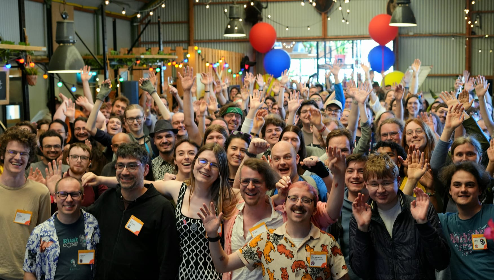

+++
title = "Linebender in May 2025"
authors = ["Olivier Faure"]
+++

Linebender is an informal open-source organization working on various projects to advance the state of the art in GUI for [the Rust programming language](https://rust-lang.org).

## RustWeek

This month saw the [RustWeek 2025](https://rustweek.org/) conference, in Utrecht in the Netherlands.

A lot of things happened!

### The talks

Raph Levien gave a talk titled *Faster, easier 2D vector rendering*, about Vello's new architecture.
The talk had some nice visuals and a pretty cool demo!

<iframe width="560" height="315" src="https://www.youtube-nocookie.com/embed/_sv8K190Zps?si=s-NdOxRPaBmS9FdQ" title="YouTube video player" frameborder="0" allow="accelerometer; autoplay; clipboard-write; encrypted-media; gyroscope; picture-in-picture; web-share" referrerpolicy="strict-origin-when-cross-origin" allowfullscreen></iframe>

Matt Campbell gave a talk titled *AccessKit: reusable UI accessibility*, showing off AccessKit and its API and architecture.
The talk also came with a cool demo, showcasing AccessKit's Android integration.

<iframe width="560" height="315" src="https://www.youtube-nocookie.com/embed/OI2TzJ6Sw10?si=FBRXVnlmasTLr_bF" title="YouTube video player" frameborder="0" allow="accelerometer; autoplay; clipboard-write; encrypted-media; gyroscope; picture-in-picture; web-share" referrerpolicy="strict-origin-when-cross-origin" allowfullscreen></iframe>

### The Anniversary

RustWeek also [the release of Rust 1.87](https://blog.rust-lang.org/2025/05/15/Rust-1.87.0/), which also fell exactly on the 10 year anniversary for Rust 1.0!

(If you're like me and you're wondering how that works: Rust has one release every six weeks. `87 * 6 * 7 == 3654` and `3654 == 365 * 10 + 4`. Between 2015 and 2025, there have been four bissextile years: 2016, 2020, 2024, and... wait a minute. Well, turns out Rust 1.1 came out one day earlier than the six-weeks schedule implies, June 25 2015 instead of June 26 2015. There may have been other discrepancies, I haven't checked all the dates.)

Anyway, there was a nice release party, where various Rust maintainers talked about what the language meant to them, and showed us the release process live.

There was also a group photo.

Look closely and you may see some cameos from the Linebender team!

### The Unconference

<!-- TODO: What the heck did we even do during the unconference? -->

## Masonry

Masonry is the widget system developed by Linebender.
It provides a non-opinionated retained widget tree, designed as a base layer for high-level GUI frameworks.

- [xilem#950][]: Adds support for [`ui-events`][] crate.
- [xilem#961][]: Adds default property values and a default theme.
- [xilem#960][]: Adds shadow property.
- [xilem#973][]: Release Masonry 0.3.

## Xilem

Xilem is our flagship GUI project, inspired by SwiftUI, which uses Masonry for its widgets.
It lets you build user interfaces declaratively by composing lightweight views together, and will diff them to provide minimal updates to a retained layer.

- [xilem#964][]: Handles Masonry properties for more styling options.
- [xilem#973][]: Release Xilem 0.3.

## Vello

Vello is our GPU vector renderer.
It can draw large 2D scenes with high performance, using GPU compute shaders for most of the work.

- [vello#524][]: Implements pipeline caching, drastically improving Android startup times.
- [vello#963][]: Rounds vertical hinting offsets.
- [vello#966][]: Releases Vello 0.5.0.

This month we continued seeing a massive amount of activity on Vello's sparse strips renderers (see Raph's video above for details), thanks in part to the tireless contributions of Canva developers Alex Gemberg, Taj Pereira and Andrew Jakubowicz, and to the continued work of Laurenz Stampfl as part of his master's project.

- [vello#937][]: Adds support for rendering bitmap and COLR glyphs.
- [vello#948][]: Adds support for drawing blurred, rounded rectangles.
- [vello#957][]: Adds clipping and spatiotemportal allocation to vello_hybrid.
- [vello#1011][]: Adds native WebGL backend for vello_hybrid.
- [vello#1008][]: Makes vello_common and vello_cpu no_std.

This month also saw the first release of vello_cpu!
It's still very experimental (version 0.0.1) and likely to see all sorts of breaking changes, and performance isn't great, but if you want to experiment with it, you can run `cargo add vello_cpu` in your terminal and start hacking away.

## Parley

Parley is a text layout library.
It handles text layout, mostly at the level of line breaking and resolving glyph positions.

- [parley#334][]: Adds editor features required for Android IME.
- [parley#344][]: Adds option to quantize vertical layout metrics.
- [parley#346][]: Enables Parley/Fontique to compile to wasm with default features enabled, for better discoverability of the wasm target.
- [parley#349][]: Releases Parley 0.4.0. 
- [parley#362][]: Adds absolute and metrics-relative line height styles.

## Get Involved

We welcome collaboration on any of our crates.
This can include improving the documentation, implementing new features, improving our test coverage, or using them within your own code.

We host an hour long office hours meeting each week where we discuss what's going on in our projects.
See [#office hours in Zulip](https://xi.zulipchat.com/#narrow/channel/359642-office-hours) for details.
We've also started a separate office hours time dedicated to the renderer collaboration, details also available at that link.

- Daniel and Olivier's "office hours" appointments can still be booked by anyone for open-ended discussion of the ecosystem.
  - [See Daniel's schedule here](https://calendar.google.com/calendar/u/0/appointments/schedules/AcZssZ32eQYJ9DtZ_wJaYNtT36YioETiloZDIdImFpBFRo5-XsqGzpikgkg47LPsiHhpiwiQ1orOwwW2).
  - [See Olivier's schedule here](https://calendar.google.com/calendar/u/0/appointments/schedules/AcZssZ2t767ZRETD_TkRI_VxK2ZTG0VrO9OZ4l7HvTxefhtJcg85iK0ZN7zWNnAEZtH0Dn7C1GKxrmYM).

[Color]: https://docs.rs/color/
[CSS Color Module Level 4]: https://www.w3.org/TR/css-color-4/

[Kompari]: https://github.com/linebender/kompari

[`ui-events`]: https://github.com/endoli/ui-events

[xilem#950]: https://github.com/linebender/xilem/pull/950
[xilem#961]: https://github.com/linebender/xilem/pull/961
[xilem#960]: https://github.com/linebender/xilem/pull/960
[xilem#973]: https://github.com/linebender/xilem/pull/973
[xilem#964]: https://github.com/linebender/xilem/pull/964
[xilem#973]: https://github.com/linebender/xilem/pull/973
[vello#524]: https://github.com/linebender/vello/pull/524
[vello#963]: https://github.com/linebender/vello/pull/963
[vello#966]: https://github.com/linebender/vello/pull/966
[vello#937]: https://github.com/linebender/vello/pull/937
[vello#948]: https://github.com/linebender/vello/pull/948
[vello#957]: https://github.com/linebender/vello/pull/957
[vello#1011]: https://github.com/linebender/vello/pull/1011
[vello#1008]: https://github.com/linebender/vello/pull/1008
[parley#334]: https://github.com/linebender/parley/pull/334
[parley#344]: https://github.com/linebender/parley/pull/344
[parley#346]: https://github.com/linebender/parley/pull/346
[parley#349]: https://github.com/linebender/parley/pull/349
[parley#362]: https://github.com/linebender/parley/pull/362
