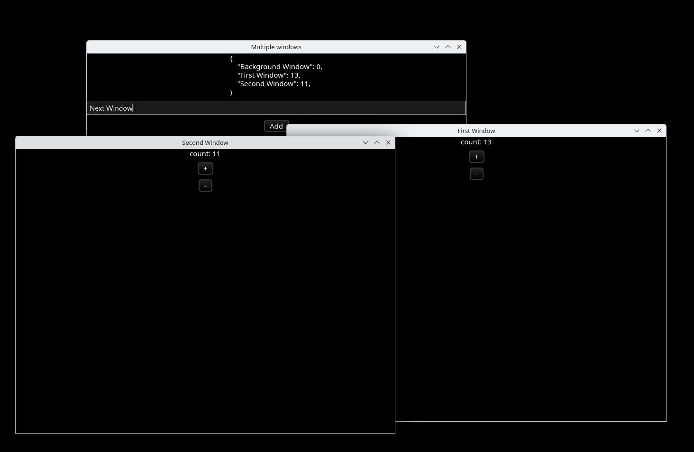
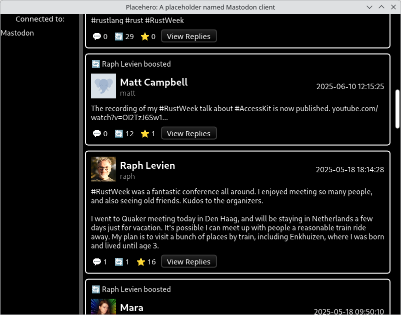

+++
title = "Linebender in June 2025"
authors = ["Daniel McNab"]
+++

Linebender is an informal open-source organization working on various projects to advance the state of the art in GUI for [the Rust programming language](https://rust-lang.org).

## Vello

Vello is our GPU vector renderer.
It can draw large 2D scenes with high performance, using GPU compute shaders for most of the work.

- [vello#1062][]: Add smoke test for layer size, by sagudev.
- [vello#1019][]: Add Kompari support.

This month we continued seeing a massive amount of activity on the sparse strips renderers, a collaborative evolution of Vello.

- [vello#1023][], [vello#1029][], [vello#1041][] (among others): Optimisations.
- [vello#1044][], [vello#1047][]: Multithreading support.
- [vello#1053][]: Add SIMD support (see below).
- [vello#1060][]: Make glyph rendering optional in the CPU renderer.
- [vello#1065][], [vello#1070][]: Improved automated testing.
- [kurbo#427][] (in review): A new stroke expander with significant performance improvements.

This [working roadmap](https://docs.google.com/document/d/1ZquH-53j2OedTbgEKCJBKTh4WLE11UveM10mNdnVARY/edit?tab=t.0#heading=h.j3duh9pgdm94) outlines the planned timeline for work on the renderers over the next year.

### Fearless_simd

Much of the recent work on sparse strip rendering has been SIMD-accelerated implementation of the parts running on CPU.
Here, [vello#1053][] is something of the tip of the iceberg.
Our [*A plan for SIMD*](@/blog/2025-06-06-a-plan-for-simd.md) blog post sketched out our plans to build an abstraction layer to write SIMD code in a safe, portable way, in contrast to the original prototyping which was all done in unsafe `core::arch` intrinsics.
Since then, there has been rapid progress on the [fearless_simd] project, focusing on SIMD primitives needed to accelerate rendering.
Support for WASM is particularly strong.

The crate has been moving fast and there are no stability guarantees yet, but we are very hopeful that it will be a solid foundation for other projects that can benefit from SIMD acceleration.
We invite projects to start experimenting, and give us feedback.
Discussion is in the [#simd channel] on the Linebender Zulip.

## Masonry

Masonry is the widget system developed by Linebender.
It provides a non-opinionated retained widget tree, designed as a base layer for high-level GUI frameworks.

- [xilem#987][]: Route text events to the root widget if there is no focused widget.
- [xilem#1038][]: Support multiple (top-level) desktop windows in Masonry, by Martin Fischer.
- [xilem#1009][]: Add properties which only take effect when a widget is hovered/disabled/active.
- [xilem#1043][], [xilem#1044][]: Split out a Masonry Core crate, which can increase parallelism in compilation.
- [xilem#1048][]: Split testing into a Masonry Testing crate, allowing certainty that test code isn't inadvertently included in release binaries.
- [xilem#1053][], [xilem#1054][], [xilem#1055][], [xilem#1056][]: Add properties to `Textbox`, `Checkbox`, `Flex`, `Grid`, and `SizedBox`.
- [xilem#1086][]: Validate accessibility tree updates in tests.

<figure>

<figcaption>

As of [xilem#1038][] Masonry (and Xilem) support multiple windows.

</figcaption>
</figure>

## Xilem

Xilem is our flagship GUI project, inspired by SwiftUI, which uses Masonry for its widgets.
It lets you build user interfaces declaratively by composing lightweight views together, and will diff them to provide minimal updates to a retained layer.

- [xilem#608][]: A `ViewSequence` called `WithoutElements`, to allow including side-effects in lists of element children.
- [xilem#992][]: Add support for multiple (top-level) desktop windows in Xilem, by Martin Fischer.
- [xilem#1071][]: Split Xilem into modules.
- [xilem#1079][], [xilem#1085][]: Provide the app's state to each `View` during more phases. This will allow many future architecture explorations.
- [xilem#1078][]: Allow accessing the channel of new requests for a `worker` directly.
- [xilem#1094][]: Refactor `lens` into its own view so that the state doesn't need to passed when constructing the view.
- [xilem#1097][]: Small example to teach variable length lists, by Nils Martel.
- [xilem#1102][]: Add a helper for flex rows, to improve readability of layout code.

In June, we started a new initiative for Xilem, a Mastodon client example.
This is being developed alongside Xilem to focus its development.

- [xilem#1087][]: Display a single scrollable timeline.
- [xilem#1089][], [xilem#1116][]: Add simple HTML processing to make posts more readable.
- [xilem#1091][]: Load and display the avatar of post authors.
- [xilem#1092][]: Improve the styling of posts.
- [xilem#1108][]: Correctly display boosted posts.
- [xilem#1114][]: Allow viewing replies to a post.

<figure>

<figcaption>

The Hero app is currently hardcoded to show a subset of [Raph's timeline](https://mastodon.online/@raph).

</figcaption>
</figure>

## Parley

Parley is a text layout library.
It handles text layout, mostly at the level of line breaking and resolving glyph positions.

In June, we released Parley [0.5.0](https://github.com/linebender/parley/releases/tag/v0.5.0).
This includes features we talked about in previous months, including restoring `Layout: Sync`, and improvements to line height handling.

- [parley#376][]: An initial version of `AttributedText`.
- [parley#381][]: Select "hard lines" rather than soft lines when triple clicking.
- [parley#382][]: Use ui-events-winit in the Vello Editor example.

## Android View

[Andrdoid View](https://github.com/rust-mobile/android-view) was handed over to the Rust Mobile organisation.

## Get Involved

We welcome collaboration on any of our crates.
This can include improving the documentation, implementing new features, improving our test coverage, or using them within your own code.

We host an hour long office hours meeting each week where we discuss what's going on in our projects.
We're also running a separate office hours time dedicated to the renderer collaboration, details also available at that link.
See [#office hours in Zulip](https://xi.zulipchat.com/#narrow/channel/359642-office-hours) for details.

If you wish to discuss the Linebender project individually, Daniel is offering ["office hours" appointments](https://calendar.google.com/calendar/u/0/appointments/schedules/AcZssZ32eQYJ9DtZ_wJaYNtT36YioETiloZDIdImFpBFRo5-XsqGzpikgkg47LPsiHhpiwiQ1orOwwW2), which are free to book.
It really helps us to learn what aspects our users care about the most.

[kurbo#427]: https://github.com/linebender/kurbo/pull/427

[parley#376]: https://github.com/linebender/parley/pull/376
[parley#381]: https://github.com/linebender/parley/pull/381
[parley#382]: https://github.com/linebender/parley/pull/382

[vello#1019]: https://github.com/linebender/vello/pull/1019
[vello#1023]: https://github.com/linebender/vello/pull/1023
[vello#1029]: https://github.com/linebender/vello/pull/1029
[vello#1041]: https://github.com/linebender/vello/pull/1041
[vello#1044]: https://github.com/linebender/vello/pull/1044
[vello#1047]: https://github.com/linebender/vello/pull/1047
[vello#1053]: https://github.com/linebender/vello/pull/1053
[vello#1060]: https://github.com/linebender/vello/pull/1060
[vello#1062]: https://github.com/linebender/vello/pull/1062
[vello#1065]: https://github.com/linebender/vello/pull/1065
[vello#1070]: https://github.com/linebender/vello/pull/1070

[xilem#608]: https://github.com/linebender/xilem/pull/608
[xilem#987]: https://github.com/linebender/xilem/pull/987
[xilem#992]: https://github.com/linebender/xilem/pull/992
[xilem#1009]: https://github.com/linebender/xilem/pull/1009
[xilem#1038]: https://github.com/linebender/xilem/pull/1038
[xilem#1043]: https://github.com/linebender/xilem/pull/1043
[xilem#1044]: https://github.com/linebender/xilem/pull/1044
[xilem#1048]: https://github.com/linebender/xilem/pull/1048
[xilem#1053]: https://github.com/linebender/xilem/pull/1053
[xilem#1054]: https://github.com/linebender/xilem/pull/1054
[xilem#1055]: https://github.com/linebender/xilem/pull/1055
[xilem#1056]: https://github.com/linebender/xilem/pull/1056
[xilem#1071]: https://github.com/linebender/xilem/pull/1071
[xilem#1078]: https://github.com/linebender/xilem/pull/1078
[xilem#1079]: https://github.com/linebender/xilem/pull/1079
[xilem#1085]: https://github.com/linebender/xilem/pull/1085
[xilem#1086]: https://github.com/linebender/xilem/pull/1086
[xilem#1087]: https://github.com/linebender/xilem/pull/1087
[xilem#1089]: https://github.com/linebender/xilem/pull/1089
[xilem#1091]: https://github.com/linebender/xilem/pull/1091
[xilem#1092]: https://github.com/linebender/xilem/pull/1092
[xilem#1094]: https://github.com/linebender/xilem/pull/1094
[xilem#1097]: https://github.com/linebender/xilem/pull/1097
[xilem#1102]: https://github.com/linebender/xilem/pull/1102
[xilem#1108]: https://github.com/linebender/xilem/pull/1108
[xilem#1114]: https://github.com/linebender/xilem/pull/1114
[xilem#1116]: https://github.com/linebender/xilem/pull/1116

[fearless_simd]: https://github.com/raphlinus/fearless_simd
[#simd channel]: https://xi.zulipchat.com/#narrow/channel/514230-simd
