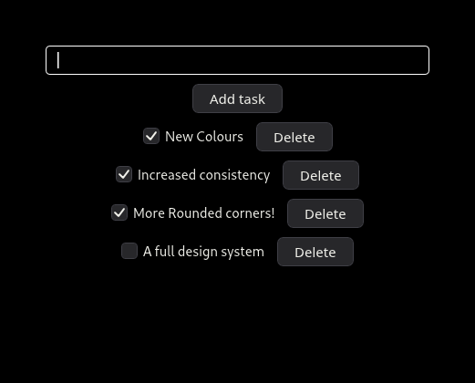

+++
title = "Linebender in July 2025"
authors = ["Daniel McNab", " Laurenz Stampfl"]
+++

Linebender is an informal open-source organization working on various projects to advance the state of the art in GUI for [the Rust programming language](https://rust-lang.org).

## Vello

Vello is our GPU vector renderer.
It can draw large 2D scenes with high performance, using GPU compute shaders for most of the work.

- [vello#785][]: Fixed strokes with a width of zero being treated as fills.
- [vello#908][]: Updated to wgpu version 25.
- [vello#1093][]: Disabled runtime checks in shaders using wgpu's new `create_shader_module_trusted` API, by sagudev.

This month's progress on the sparse strips renderers, a collaborative evolution of Vello, has been centered around adding support for NEON and WASM SIMD, as well as making further improvements to multi-threaded rendering.

- [vello#1064][], [vello#1086][]: Image rendering in Vello Hybrid.
- [vello#1078][]: Rewrote Vello CPU to be more SIMD-friendly.
- [vello#1092][]: Adds support for SIMD flattening.
- [vello#1103][]: Optimises alpha coverage calculation in strip rendering.
- [vello#1105][]: Ignores paths containing NaN points, giving a warning.
- [vello#1122][]: Adds opacity layers to Vello Hybrid.
- [vello#1134][]: Reuses FlattenCtx for paths.
- [kurbo#427][]: Contains a new stroke expander with significant performance improvements.

Our [working roadmap](https://docs.google.com/document/d/1ZquH-53j2OedTbgEKCJBKTh4WLE11UveM10mNdnVARY/edit?tab=t.0#heading=h.j3duh9pgdm94) outlines the planned timeline for work on the renderers into next year.

An integration of Vello as the backend for Servo's canvas rendering has landed in [servo#36821][] (and also Vello CPU in [servo#38282][]).
You can follow this work at [servo#38345][].

### Benchmarking

We have performed some benchmarking to understand where Vello CPU's performance lies in the available 2d renderers.
We did this by creating [a fork of the Blend2D benchmark harness](https://github.com/LaurenzV/blend2d-apps/tree/benching) with the addition of Vello CPU.
We also added Tiny Skia, which is also stewarded by Linebender and is another popular renderer written in Rust.
You can read more about the benchmark methodology on [Blend2D's performance page](https://blend2d.com/performance.html).
We wish to thank the Blend2D team for creating this excellent suite of tests.

<!-- We did try embedding the results here, but it doesn't really work nicely -->
<!-- 

<iframe src="https://laurenzv.github.io/vello_chart/" id="tmil19-vello-charts-frame"></iframe>

 -->

The [benchmark results page](https://laurenzv.github.io/vello_chart/) shows the results of running this suite on an Apple M1 Pro.
This shows the results for Blend2D, Agg, Tiny Skia, Vello CPU, Cairo, Skia, and JUCE.
The source for this results page is available on GitHub at <https://github.com/LaurenzV/vello_chart>.

Some things that should be noted here:

- Vello CPU is still under active development, so these are only preliminary results.
- We currently do not support x86-64 SIMD, which is why these charts currently only show an ARM machine.
  As noted below, we're actively working on x86-64 support.
- Tiny Skia's relative performance [is documented](https://github.com/linebender/tiny-skia?tab=readme-ov-file#performance) to be worse on ARM than on x86-64.
  We therefore expect the performance gap between Vello CPU and Tiny Skia to be smaller on x86-64.

It is clear that `vello-cpu` has very impressive performance and on track to become the fastest CPU-only renderer in the Rust ecosystem!
Blend2D is still the clear winner in these tests, but `vello-cpu` takes second place in many of the benchmarks, often beating other mature renderers such as Skia and Cairo.
This is especially the case as the size of the geometry gets larger.
Blend2D and `vello-cpu` both offer multi-threaded rendering modes (marked by the 2T/4T/8T suffixes, as opposed to ST for single threaded).
Vello CPU's multithreading is especially effective when drawing larger geometries with curves or when using complex paints such as gradients or patterns.

### Fearless SIMD

Fearless SIMD is our SIMD infrastructure library.
We are developing it in concert with the Vello sparse strips renderers, particularly `vello_cpu`.

To support the significant Vello CPU refactor using SIMD, this month saw the addition of more methods implemented in both Neon and WebAssembly.
Thanks to new contributions from Benjamin Saunders we've started on SSE 4.2 support for `x86` architectures.

- [fearless_simd#24][], [fearless_simd#26][], [fearless_simd#27][]: Implement all WASM SIMD methods.
- [fearless_simd#31][]: Introduce semantic conversion traits, by Benjamin Saunders.
- [fearless_simd#42][] (not yet merged): SSE 4.2 support, by Benjamin Saunders.

## Masonry

Masonry is the widget system developed by Linebender.
It provides a non-opinionated retained widget tree, designed as a base layer for high-level GUI frameworks.

<!-- TODO: Maybe trim again? -->
- [xilem#1077][]: Added the accessibility integration for VirtualScroll.
- [xilem#1096][]: Improved the default styles in Masonry, by Marco Melorio.
- [xilem#1124][]: Make Checkbox support keyboard interaction, by tannal.
- [xilem#1130][]: Rename `Textbox` to `TextInput`.
- [xilem#1163][]: Make text color controlled through properties.
- [xilem#1168][]: Add `IndexedStack` widget, by Kiran Wells.
- [xilem#1170][], [xilem#1178][]: Use [Anymore](#anymore) for all actions.
- [xilem#1189][]: Add the active status.
- [xilem#1200][]: Simplify both exclusive and immutable raw access to child widgets.
- [xilem#1212][]: Add a convenience associated type for the action type generated by each widget.
- [xilem#1213][]: Add a post_paint pass, designed for box shadows.
- [xilem#1215][]: Create a `NewWidget` type, which encapsulates the metadata associated with new widgets.
- [xilem#1223][]: Add cache to avoid relayouts when constraints haven't changed.
- [xilem#1237][]: Add rudimentary clipboard support.
- [xilem#1239][]: Add pixel snapping to layout pass.
- [xilem#1246][]: Use properties in `ProgressBar`, by Pufferfish.
- [xilem#1248][]: Make all widget associated properties be stored in the same arena.
- [xilem#1253][]: Let Masonry's button have any, by Nixon.

<figure>

<figcaption>

As of [xilem#1096][] Masonry's default styles have been improved.
This is not a full design system, but is a piecewise improvement.

</figcaption>
</figure>

## Xilem

Xilem is our flagship GUI project, inspired by SwiftUI, which uses Masonry for its widgets.
It lets you build user interfaces declaratively by composing lightweight views together, and will diff them to provide minimal updates to a retained layer.
Our work on Placehero, which is the working name for our Mastodon client example, has inspired several significant architectural improvements in Xilem.

- [xilem#1117][], [xilem#1122][]: Make `DynMessage` not require `Send`, and remove the `Message` generic from View.
- [xilem#1142][]: Add an environment system.
- [xilem#1170][]: Use [Anymore](#anymore) for messages.
- [xilem#1220][], [xilem#1256][]: Use the environment system for avatars in Placehero.
- [xilem#1257][]: Avoid per-frame potential  allocations in views with multiple children (i.e. Flex, Grid).

<figure>

<figcaption>

For July, we would like to showcase this Chess GUI developed using Xilem by Dr. Salewski.
It can be found in its repository at <https://github.com/StefanSalewski/xilem-chess>.

</figcaption>
</figure>

## Anymore

You might have noticed mentions of [Anymore](https://github.com/linebender/anymore) in both the Xilem and Masonry sections.
This is a new crate which we've created for the `AnyDebug` trait.
This allows creating dynamically typed values which can be inspected, making debugging downcasting failures much easier.
This crate is designed for stability, so that it can be used for interoperability between projects (without allocation).
We plan to release version 1.0 in early August.

## Parley

Parley is a text layout library.
It handles text layout, mostly at the level of line breaking and resolving glyph positions.

- [parley#378][]: Reimplements the fontconfig backend using FFI, improving font matching.
- [parley#378][]: Implements shift-click selection extension, by kekelp.
- [parley#389][]: Renames variants to more closely match CSS.
- [parley#395][]: Adds a method to unregister a loaded font.

## Kurbo

We released [Kurbo 0.11.3][], with some ergonomics and performance improvements, calculation of moments using Green's theorem, and other methods.

As mentioned in the Vello section, the new, faster stroke expansion logic ([kurbo#427][]) has landed in main.
This will be in the upcoming 0.12 release, which is semver-breaking because of changes to the API to reduce memory allocation.

## Raph's job change

Raph Levien has decided to take a voluntary exit offer from Google.
He is very grateful for the opportunity and the support from Google Fonts of Linebender and Rust UI projects.
His last day there will be October 12.
He has a new gig lined up, as well – he plans to join Canva in January, working on rendering and Rust.
That also involves a move to Australia, an exciting new adventure.
Through all the changes, he intends to continue his work on Linebender and Rust UI, though towards the end of the year he will be taking things a bit easy.
The timing of office hours will also need to change, to accommodate the time zone; more updates will be forthcoming.

## Get Involved

We welcome collaboration on any of our crates.
This can include improving the documentation, implementing new features, improving our test coverage, or using them within your own code.

We host an hour long office hours meeting each week where we discuss what's going on in our projects.
We're also running a separate office hours time dedicated to the renderer collaboration, details also available at that link.
See [#office hours in Zulip](https://xi.zulipchat.com/#narrow/channel/359642-office-hours) for details.

If you wish to discuss the Linebender project individually, Daniel is offering ["office hours" appointments](https://calendar.google.com/calendar/u/0/appointments/schedules/AcZssZ32eQYJ9DtZ_wJaYNtT36YioETiloZDIdImFpBFRo5-XsqGzpikgkg47LPsiHhpiwiQ1orOwwW2), which are free to book.
It really helps us to learn what aspects our users care about the most.

[vello#1064]: https://github.com/linebender/vello/pull/1064
[vello#1078]: https://github.com/linebender/vello/pull/1078
[vello#1086]: https://github.com/linebender/vello/pull/1086
[vello#1092]: https://github.com/linebender/vello/pull/1092
[vello#1093]: https://github.com/linebender/vello/pull/1093
[vello#1103]: https://github.com/linebender/vello/pull/1103
[vello#1105]: https://github.com/linebender/vello/pull/1105
[vello#1122]: https://github.com/linebender/vello/pull/1122
[vello#1134]: https://github.com/linebender/vello/pull/1134
[vello#785]: https://github.com/linebender/vello/pull/785
[vello#908]: https://github.com/linebender/vello/pull/908

[kurbo#427]: https://github.com/linebender/kurbo/pull/427

[servo#36821]: https://github.com/servo/servo/pull/36821
[servo#38282]: https://github.com/servo/servo/pull/38282
[servo#38345]: https://github.com/servo/servo/pull/38345

[fearless_simd#24]: https://github.com/linebender/fearless_simd/pull/24
[fearless_simd#26]: https://github.com/linebender/fearless_simd/pull/26
[fearless_simd#27]: https://github.com/linebender/fearless_simd/pull/27
[fearless_simd#31]: https://github.com/linebender/fearless_simd/pull/31
[fearless_simd#42]: https://github.com/linebender/fearless_simd/pull/42

[parley#378]: https://github.com/linebender/parley/pull/378
[parley#389]: https://github.com/linebender/parley/pull/389
[parley#395]: https://github.com/linebender/parley/pull/395

[xilem#1077]: https://github.com/linebender/xilem/pull/1077
[xilem#1096]: https://github.com/linebender/xilem/pull/1096
[xilem#1117]: https://github.com/linebender/xilem/pull/1117
[xilem#1122]: https://github.com/linebender/xilem/pull/1122
[xilem#1124]: https://github.com/linebender/xilem/pull/1124
[xilem#1130]: https://github.com/linebender/xilem/pull/1130
[xilem#1142]: https://github.com/linebender/xilem/pull/1142
[xilem#1163]: https://github.com/linebender/xilem/pull/1163
[xilem#1168]: https://github.com/linebender/xilem/pull/1168
[xilem#1170]: https://github.com/linebender/xilem/pull/1170
[xilem#1178]: https://github.com/linebender/xilem/pull/1178
[xilem#1189]: https://github.com/linebender/xilem/pull/1189
[xilem#1200]: https://github.com/linebender/xilem/pull/1200
[xilem#1212]: https://github.com/linebender/xilem/pull/1212
[xilem#1213]: https://github.com/linebender/xilem/pull/1213
[xilem#1215]: https://github.com/linebender/xilem/pull/1215
[xilem#1220]: https://github.com/linebender/xilem/pull/1220
[xilem#1223]: https://github.com/linebender/xilem/pull/1223
[xilem#1237]: https://github.com/linebender/xilem/pull/1237
[xilem#1239]: https://github.com/linebender/xilem/pull/1239
[xilem#1246]: https://github.com/linebender/xilem/pull/1246
[xilem#1248]: https://github.com/linebender/xilem/pull/1248
[xilem#1253]: https://github.com/linebender/xilem/pull/1253
[xilem#1256]: https://github.com/linebender/xilem/pull/1256
[xilem#1257]: https://github.com/linebender/xilem/pull/1257

[Kurbo 0.11.3]: https://github.com/linebender/kurbo/releases/tag/v0.11.3
