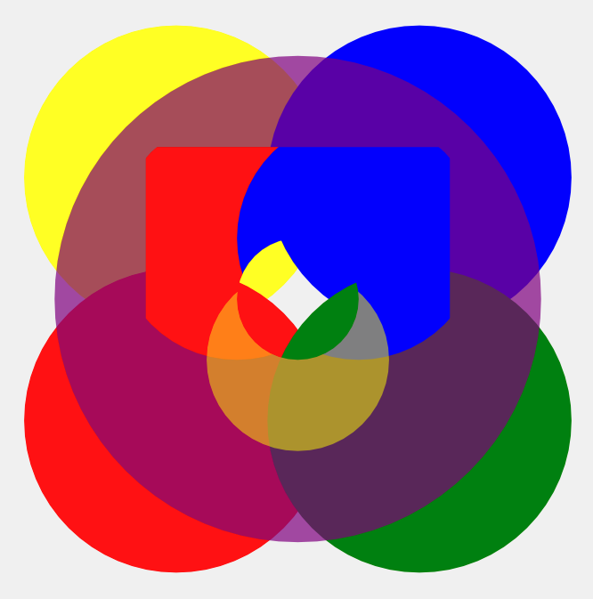
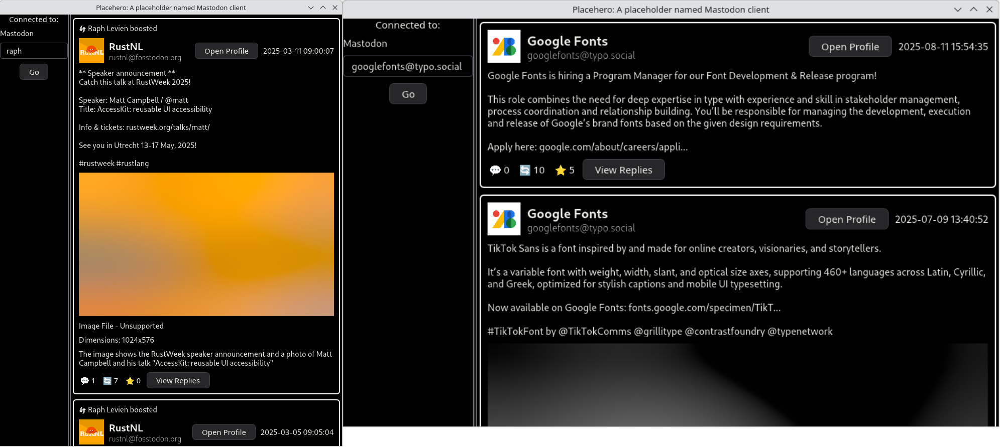

+++
title = "Linebender in August 2025"
authors = ["Daniel McNab"]
+++

Linebender is an informal open-source organization working on various projects to advance the state of the art in GUI for [the Rust programming language](https://rust-lang.org).

## Parley

Parley is a text layout library.
It handles text layout, mostly at the level of line breaking and resolving glyph positions.

- [parley#400][]: Migrates Parley to [HarfRust](https://github.com/harfbuzz/harfrust) for shaping, which is a Rust port of HarfBuzz.
- [parley#405][]: Adds a selection of benchmarks.
- [parley#406][], [parley#413][]: Adds internal caching, improving performance significantly.

## Vello

Vello is our GPU vector renderer.
It can draw large 2D scenes with high performance, using GPU compute shaders for most of the work.

- [vello#1096][]: Updated to Wgpu version 26.
- [vello#1161][]: Simplifies the API for rendering a wgpu `Texture` into a Vello `Scene`.
- [vello#1169][]: Increased the Skrifa version to v0.35.0. This was backported as [Vello v0.5.1](https://github.com/linebender/vello/releases/tag/v0.5.1).
- [vello#1182][]: Fixed a longstanding issue with our examples, where they would crash if the window was minimised on windows.

The biggest updates to the sparse strip renderers this month are the support for blending and caching in Vello Hybrid.
We have also had continued SIMD improvements, including x86 support.

- [vello#1136][]: Allows disabling anti-aliasing.
- [vello#1137][], [vello#1153][]: Add support for caching sparse strips.
- [vello#1149][]: Support for SSE4.2 and AVX2 SIMD (i.e. on x86 and x86_64).
  The [benchmark results viewer](https://laurenzv.github.io/vello_chart/) has been updated to include some x86_64 results.
- [vello#1177][]: Move to the new v0.2.0 release of Fearless SIMD.
- [vello#1155][], [vello#1178][]: Add full support for blending to Vello Hybrid.

<!-- TODO: This roadmap is a bit out of date.
Our [working roadmap](https://docs.google.com/document/d/1ZquH-53j2OedTbgEKCJBKTh4WLE11UveM10mNdnVARY/edit?tab=t.0#heading=h.j3duh9pgdm94) outlines the planned timeline for work on the renderers into next year. -->

<figcaption>

Blending is now supported by Vello Hybrid.

</figcaption>
</figure>

We have additionally been doing further work on Vello's imaging model.
This is partly in service of the integrations of Vello in [Graphite](https://graphite.rs/) and [Servo](https://servo.org/).

- [color#191][], [peniko#115][] (in progress): Add support for interpolating gradients in unpremultiplied space.
  This is provided for web compatibility, and shouldn't be used by most users.
- [peniko#117][]: Split Image into the sampler and data.
- [peniko#120][], [peniko#121][]: Add `Brga` and premultiplied image formats.
- [vello#1183][] (in progress): Support luminance masks.

As of [servo#38962][], Vello and Vello CPU are the only canvas backends used in Servo.

### Fearless SIMD

Fearless SIMD is our SIMD infrastructure library.
We are developing it in concert with the Vello sparse strips renderers, particularly `vello_cpu`.
We released [Fearless SIMD v0.2.0](https://github.com/linebender/fearless_simd/releases/tag/v0.2.0), the first Fearless SIMD release since 2018.
This included the following changes from August:

- [fearless_simd#50][], [fearless_simd#52][]: Add SSE4.2 support.
- [fearless_simd#58][]: Add some initial docs.
- [fearless_simd#59][]: Add basic AVX2 support.
- [fearless_simd#61][]: Removes `f16` support to prepare for release.
- [fearless_simd#69][]: Fixes a soundness issue with unsafe SIMD functions.

With this release, Fearless SIMD is now ready for experimental use outside of Linebender.
It now provides a solid way for writing portable SIMD operations across WASM, Aarch64, x86, and x86_64.
Note however that the library is still in a quite early state - in particular, our documentation is currently only cursory.
Contributions to improve this would be welcome!

## Masonry

Masonry is the widget system developed by Linebender.
It provides a non-opinionated retained widget tree, designed as a base layer for high-level GUI frameworks.

- [xilem#1207][]: Make `ObjectFit`, `Linebreaking` and `SpinnerColor` properties.
- [xilem#1212][]: Add `Widget::Action`, which indicates the action type widgets return.
- [xilem#1226][]: Refactor tab focus.
- [xilem#1228][]: Add placeholder text to text input.
- [xilem#1250][]: Move widgets to use a `Length` type, which represents a number of logical pixels.
- [xilem#1269][]: Introduce "focus fallback" mechanism.
- [xilem#1273][]: Update to Anymore v1.0.
- [xilem#1282][], many others: Add unit tests for passes.
- [xilem#1295][]: Merge `TextColor` and `SpinnerColor` into `ContentColor`.
- [xilem#1310][]: Cleans up how the event loop handles being suspended, by Nixon.
- [xilem#1312][]: Remove the generic on VirtualScroll.
- [xilem#1314][]: Makes the focused indicator for checkboxes larger, by tannal.
- [xilem#1320][]: Add `NewWindow` struct to encapsulate attributes needed to create a window.
- [xilem#1321][]: When a new font is loaded, relayout everything.
- [xilem#1332][]: Restore base colour customisation.
- [xilem#1349][]: Move Masonry's examples from "Masonry Winit" to "Masonry".
- [xilem#1353][]: Limit the size of screenshot tests to 8KiB by default.
- [xilem#1366][]: Make the `Checkbox`'s checked state be controlled only by the driver.
- [xilem#1371][]: Fix and optimise window resizing and minimising.

## Xilem

Xilem is our flagship GUI project, inspired by SwiftUI, which uses Masonry for its widgets.
It lets you build user interfaces declaratively by composing lightweight views together, and will diff them to provide minimal updates to a retained layer.

- [xilem#1260][]: Make the virtual scroll implementation much saner.
- [xilem#1273][]: Update to Anymore v1.0.
- [xilem#1363][]: Fix the `declare_property_tuple` macro, by Alex Moon.
- [xilem#1278][]: Add `Prop`, which changes how Masonry `Properties` are applied to more closely match Xilem Web.
- [xilem#1318][]: Fix initial font loading in easy cases.
- [xilem#1333][]: Add docs about precise capturing, by Nils Martel.
- [xilem#1348][]: Add `flex_row` and `flex_col` as convenience functions, by Paul Xu.
- [xilem#1352][]: Add error handling to virtual cats example, by Nils Martel.
- [xilem#1357][]: Fix how the `disabled` property is handled for text input.
- [xilem#1364][]: Remove the `app_state` parameter from teardown, by Alex Moon.

Placehero:

- [xilem#1323][]: Use an Action for navigation (rather than directly setting fields on the app state).
- [xilem#1337][]: Use virtual scrolling for timelines.
- [xilem#1370][]: Show the blurhash based preview of media attachments.

<figure>

<figcaption>

Placehero can now load content from anywhere in a user's timeline, and preview images (left).
It can also jump directly to a specific user's timeline by username (right).
Note that full image loading is not yet supported, only the preview based on the blurhash.

</figcaption>
</figure>

## Anymore

On 4 August, we released [Anymore v1.0.0](https://github.com/linebender/anymore/releases/tag/v1.0.0).
This is our crate for the fundamental `AnyDebug` trait, which greatly aids debugging when using dynamically typed values.
Anymore is designed to be used in public APIs; it has a minimal API surface so that it can be extremely stable.
We recommend considering it for use cases where you would otherwise be returning (potentially wrapped) `Box<dyn Any>` values from your libraries.

## Kurbo

Kurbo provides data structures and algorithms for curves and vector paths.
We've been preparing for the 0.12 release:

- [kurbo#476][]: Adds an `Axis` type taken from Masonry.
- [kurbo#483][]: Document Kurbo's feature flags.
- [kurbo#485][]: Better handle edge cases in cubic_to_quadratic, by Cosimo Lupo.
- [kurbo#486][]: Deprecate and replace existing `aspect_ratio` methods, which used a non-standard definition of aspect ratio.
- [kurbo#487][], [kurbo#488][], [kurbo#489][]: Remove many long-deprecated items.
- [kurbo#490][]: Fix miter join in dashed strokes.
- [kurbo#493][] (in progress): Convert `CubicBez::nearest` to the `poly-cool` quintic solver.

## Get Involved

We welcome collaboration on any of our crates.
This can include improving the documentation, implementing new features, improving our test coverage, or using them within your own code.

We host an hour long office hours meeting each week where we discuss what's going on in our projects.
See [#office hours in Zulip](https://xi.zulipchat.com/#narrow/channel/359642-office-hours) for details.
We're also running a separate office hours time dedicated to the renderer collaboration, details also available at that link.

If you wish to discuss the Linebender project individually, Daniel is offering ["office hours" appointments](https://calendar.google.com/calendar/u/0/appointments/schedules/AcZssZ32eQYJ9DtZ_wJaYNtT36YioETiloZDIdImFpBFRo5-XsqGzpikgkg47LPsiHhpiwiQ1orOwwW2), which are free to book.
It really helps us to learn what aspects our users care about the most.

[servo#38962]: https://github.com/servo/servo/pull/38962

[color#191]: https://github.com/linebender/color/pull/191

[fearless_simd#50]: https://github.com/linebender/fearless_simd/pull/50
[fearless_simd#52]: https://github.com/linebender/fearless_simd/pull/52
[fearless_simd#58]: https://github.com/linebender/fearless_simd/pull/58
[fearless_simd#59]: https://github.com/linebender/fearless_simd/pull/59
[fearless_simd#61]: https://github.com/linebender/fearless_simd/pull/61
[fearless_simd#69]: https://github.com/linebender/fearless_simd/pull/69

[kurbo#476]: https://github.com/linebender/kurbo/pull/476
[kurbo#483]: https://github.com/linebender/kurbo/pull/483
[kurbo#485]: https://github.com/linebender/kurbo/pull/485
[kurbo#486]: https://github.com/linebender/kurbo/pull/486
[kurbo#487]: https://github.com/linebender/kurbo/pull/487
[kurbo#488]: https://github.com/linebender/kurbo/pull/488
[kurbo#489]: https://github.com/linebender/kurbo/pull/489
[kurbo#490]: https://github.com/linebender/kurbo/pull/490
[kurbo#493]: https://github.com/linebender/kurbo/pull/493

[parley#400]: https://github.com/linebender/parley/pull/400
[parley#405]: https://github.com/linebender/parley/pull/405
[parley#406]: https://github.com/linebender/parley/pull/406
[parley#413]: https://github.com/linebender/parley/pull/413
[peniko#115]: https://github.com/linebender/peniko/pull/115
[peniko#117]: https://github.com/linebender/peniko/pull/117
[peniko#120]: https://github.com/linebender/peniko/pull/120
[peniko#121]: https://github.com/linebender/peniko/pull/121

[vello#1096]: https://github.com/linebender/vello/pull/1096
[vello#1136]: https://github.com/linebender/vello/pull/1136
[vello#1137]: https://github.com/linebender/vello/pull/1137
[vello#1149]: https://github.com/linebender/vello/pull/1149
[vello#1153]: https://github.com/linebender/vello/pull/1153
[vello#1155]: https://github.com/linebender/vello/pull/1155
[vello#1161]: https://github.com/linebender/vello/pull/1161
[vello#1169]: https://github.com/linebender/vello/pull/1169
[vello#1177]: https://github.com/linebender/vello/pull/1177
[vello#1178]: https://github.com/linebender/vello/pull/1178
[vello#1182]: https://github.com/linebender/vello/pull/1182
[vello#1183]: https://github.com/linebender/vello/pull/1183

[xilem#1207]: https://github.com/linebender/xilem/pull/1207
[xilem#1212]: https://github.com/linebender/xilem/pull/1212
[xilem#1226]: https://github.com/linebender/xilem/pull/1226
[xilem#1228]: https://github.com/linebender/xilem/pull/1228
[xilem#1250]: https://github.com/linebender/xilem/pull/1250
[xilem#1260]: https://github.com/linebender/xilem/pull/1260
[xilem#1269]: https://github.com/linebender/xilem/pull/1269
[xilem#1273]: https://github.com/linebender/xilem/pull/1273
[xilem#1278]: https://github.com/linebender/xilem/pull/1278
[xilem#1282]: https://github.com/linebender/xilem/pull/1282
[xilem#1295]: https://github.com/linebender/xilem/pull/1295
[xilem#1310]: https://github.com/linebender/xilem/pull/1310
[xilem#1312]: https://github.com/linebender/xilem/pull/1312
[xilem#1314]: https://github.com/linebender/xilem/pull/1314
[xilem#1318]: https://github.com/linebender/xilem/pull/1318
[xilem#1320]: https://github.com/linebender/xilem/pull/1320
[xilem#1321]: https://github.com/linebender/xilem/pull/1321
[xilem#1323]: https://github.com/linebender/xilem/pull/1323
[xilem#1332]: https://github.com/linebender/xilem/pull/1332
[xilem#1333]: https://github.com/linebender/xilem/pull/1333
[xilem#1337]: https://github.com/linebender/xilem/pull/1337
[xilem#1348]: https://github.com/linebender/xilem/pull/1348
[xilem#1349]: https://github.com/linebender/xilem/pull/1349
[xilem#1352]: https://github.com/linebender/xilem/pull/1352
[xilem#1353]: https://github.com/linebender/xilem/pull/1353
[xilem#1357]: https://github.com/linebender/xilem/pull/1357
[xilem#1363]: https://github.com/linebender/xilem/pull/1363
[xilem#1364]: https://github.com/linebender/xilem/pull/1364
[xilem#1366]: https://github.com/linebender/xilem/pull/1366
[xilem#1370]: https://github.com/linebender/xilem/pull/1370
[xilem#1371]: https://github.com/linebender/xilem/pull/1371
