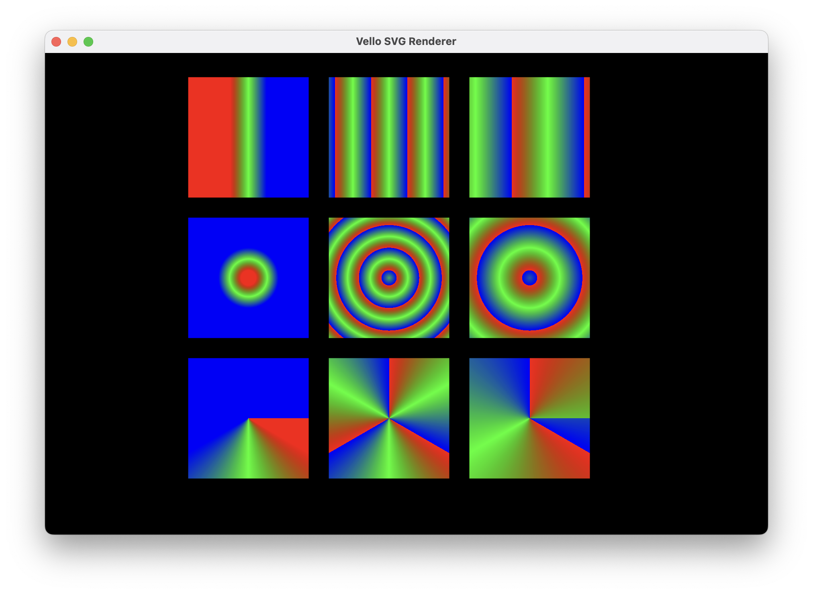

+++
title = "Linebender in September 2025"
authors = ["Daniel McNab", "Raph Levien"]
+++

Linebender is an informal open-source organization working on various projects to advance the state of the art in GUI for [the Rust programming language](https://rust-lang.org).

## Vello

Vello is our GPU vector renderer.
It can draw large 2D scenes with high performance, using GPU compute shaders for most of the work.

- [vello#1183][]: Support for luminance masks.
- [vello#1187][]: Fix flattening tolerance calculation.
- [vello#1192][]: Add `push_clip_layer`, in preparation for removing `Mix::Clip`.
- [vello#1224][]: Update to the latest Peniko main.
- [vello#1229][]: Put wgpu's default features behind a `wgpu_default` feature flag, by Stefan Tammer.

We're planning to make a Vello release early in October for compatibility with Bevy v0.17.

Our sparse strip renderers are moving towards maturity.
In September, we have had some improvements in Vello Hybrid's capabilities, and further performance optimisation.
We're planning on making an alpha release of Vello Hybrid in October.

- [vello#1188][]: Make the aliasing threshold configurable.
- [vello#1196][]: Gradient rendering in Vello Hybrid.
- [vello#1206][]: Store data about filled areas in a strip.
- [vello#1209][]: Optimise the `estimate_num_squads` method.
- [vello#1215][]: Glyph caching for hinting instances and outline paths.
- [vello#1221][]: Unify our sweep gradient handling.
- [vello#1239][]: Release [Vello CPU v0.0.2](https://github.com/linebender/vello/releases/tag/sparse-stips-v0.0.2). This release was a final release for Peniko v0.4.x compatibility, and we are planning to release Vello CPU v0.1.0 within the first half of October.

We're planning to make the beta release of Vello CPU in early October.
<!-- TODO: What to say exactly here? -->
Its performance is now extremely competitive - according to [our benchmarking](https://laurenzv.github.io/vello_chart/) is likely the fastest CPU-only renderer in Rust.
<!-- TODO: We'd like to thank Laurenz, something about Master's project, etc. -->

<!-- TODO: This roadmap is a bit out of date.
Our [working roadmap](https://docs.google.com/document/d/1ZquH-53j2OedTbgEKCJBKTh4WLE11UveM10mNdnVARY/edit?tab=t.0#heading=h.j3duh9pgdm94) outlines the planned timeline for work on the renderers into next year. -->
<figure>

<!--  -->

<figcaption>

Vello Hybrid now fully supports gradient paint types.

</figcaption>
</figure>

Linebender will be represented at the Graphite Community Meetup, details of which can be found in [their post](https://graphite.rs/blog/graphite-community-meetup-in-germany/).

### Linebender Resource Handle

Peniko's `Font` (and therefore also `Blob`) are used as vocabulary types for font resources between crates (such as Vello and Parley).
However, this meant that when Peniko made semver-incompatible releases, those crates could no longer (easily) interoperate.
Additionally, some crates (notably both Parley and Cosmic Text) only depended on Peniko for these interoperability types.

To resolve this, `Font`, `Blob`, and `WeakBlob` in Peniko are now re-exports from a new crate called [Linebender Resource Handle](https://crates.io/crates/linebender_resource_handle).
These types have identical API as in previous releases, but will now be the same type across Peniko versions.
We have made this migration in such a way that these types are also used in the minor releases of Peniko since `v0.3.x`.
This means that all releases of Parley and Vello from 2025 are entirely cross-compatible.

Additionally, in future releases, Parley will only depend on Linebender Resource Handle instead of Peniko, improving its compilation time for users who use Parley without Vello.

### Peniko

In addition to the migration to Linebender Resource Handle, we have made small but important improvements in Peniko, our crate for shared 2d rendering types.

- [peniko#115][]: Add an `InterpolationAlphaSpace` to gradients. This is helpful for implementing web specs, and should otherwise be ignored by most users.
- [peniko#123][]: Rename `ImageRenderParams` to `ImageSampler`.
- [peniko#126][]: Migrated to Linebender Resource Handle.
- [peniko#130][]: Clarify Sweep Gradient Angle rotation and unit. This now is defined to match how Vello was interpreting it.
- [peniko#139][]: Better document `Mix`, `Compose` and `Fill`.
- [peniko#144][]: Deprecate `Mix::Clip` and make it no longer the default blend mode.

Release [v0.4.1](https://github.com/linebender/peniko/releases/tag/v0.4.1) is a backport release for the Linebender Resource Handle migration.
We expect to release Peniko v0.5.0 very early in October.

## Masonry and Xilem

Masonry is the widget system developed by Linebender.
It provides a non-opinionated retained widget tree, designed as a base layer for high-level GUI frameworks.

Xilem is our flagship GUI project, inspired by SwiftUI, which uses Masonry for its widgets.
It lets you build user interfaces declaratively by composing lightweight views together, and will diff them to provide minimal updates to a retained layer.

- [xilem#1383][]: Add more window options
- [xilem#1378][]: Add Slider widget and demo
- [xilem#1386][]: Text area improvements
- [xilem#1388][]: Simplify multi-window code
- [xilem#1393][]: Fix blitting on a transparent window

There was some work in Placehero, the Mastodon client which serves as the flagship Xilem application, to support login, but not yet wired up to the UI.

<!-- TODO: Add screenshot. -->

## Parley

Parley is a text layout library.
It handles text layout, mostly at the level of line breaking and resolving glyph positions.

- [parley#410][]: Fix the last line of justified text.
- [parley#414][]: Remove Kurbo and Peniko dependencies by using [Linebender Resource Handle](#linebender-resource-handle).
- [parley#418][]: Upgrade to icu4x 2.0.
- [parley#421][] (draft): Enable floats and other advanced layouts.

## Kurbo

Kurbo provides data structures and algorithms for curves and vector paths.
We released [v0.12](https://github.com/linebender/kurbo/releases/tag/v0.12.0) at the start of September, primarily including the new stroking work, which improves performance considerably over the previous version.
In addition to the changes in that release, we also performed various optimisations.

## Fearless SIMD

Fearless SIMD is our SIMD infrastructure library.
It provides a solid way for writing SIMD operations portably across WASM, Aarch64, x86, and x86_64.
The improvements we made in September include:

- [fearless_simd#76][]: Add `SimdBase::witness`, allowing access to the `Simd` implementation from vector types.
- [fearless_simd#79][], [fearless_simd#86][]: Improved bitshifting support.
- [fearless_simd#80][]: Implement assignment operators (`+=`, etc.).
- [fearless_simd#81][]: Enable bitcasting between native-width vectors.
- [fearless_simd#88][]: Adopt FMA semantics to match `std`.
- [fearless_simd#91][]: Unary integer negation.
- [fearless_simd#96][]: Expression-oriented dispatch macro.

We look forward to seeing ecosystem use cases develop.

## Get Involved

We welcome collaboration on any of our crates.
This can include improving the documentation, implementing new features, improving our test coverage, or using them within your own code.

We host an hour long office hours meeting each week where we discuss what's going on in our projects.
See [#office hours in Zulip](https://xi.zulipchat.com/#narrow/channel/359642-office-hours) for details.
We're also running a separate office hours time dedicated to the renderer collaboration, details also available at that link.

If you wish to discuss the Linebender project individually, Daniel is offering ["office hours" appointments](https://calendar.google.com/calendar/u/0/appointments/schedules/AcZssZ32eQYJ9DtZ_wJaYNtT36YioETiloZDIdImFpBFRo5-XsqGzpikgkg47LPsiHhpiwiQ1orOwwW2), which are free to book.
It really helps us to learn what aspects our users care about the most.

[vello#1183]: https://github.com/linebender/vello/pull/1183
[vello#1187]: https://github.com/linebender/vello/pull/1187
[vello#1192]: https://github.com/linebender/vello/pull/1192
[vello#1224]: https://github.com/linebender/vello/pull/1224
[vello#1229]: https://github.com/linebender/vello/pull/1229
[vello#1188]: https://github.com/linebender/vello/pull/1188
[vello#1196]: https://github.com/linebender/vello/pull/1196
[vello#1206]: https://github.com/linebender/vello/pull/1206
[vello#1209]: https://github.com/linebender/vello/pull/1209
[vello#1215]: https://github.com/linebender/vello/pull/1215
[vello#1221]: https://github.com/linebender/vello/pull/1221
[vello#1239]: https://github.com/linebender/vello/pull/1239

[peniko#115]: https://github.com/linebender/peniko/pull/115
[peniko#123]: https://github.com/linebender/peniko/pull/123
[peniko#126]: https://github.com/linebender/peniko/pull/126
[peniko#130]: https://github.com/linebender/peniko/pull/130
[peniko#139]: https://github.com/linebender/peniko/pull/139
[peniko#144]: https://github.com/linebender/peniko/pull/144

[xilem#1383]: https://github.com/linebender/xilem/pull/1383
[xilem#1378]: https://github.com/linebender/xilem/pull/1378
[xilem#1386]: https://github.com/linebender/xilem/pull/1386
[xilem#1388]: https://github.com/linebender/xilem/pull/1388
[xilem#1393]: https://github.com/linebender/xilem/pull/1393

[fearless_simd#76]: https://github.com/linebender/fearless_simd/pull/76
[fearless_simd#79]: https://github.com/linebender/fearless_simd/pull/79
[fearless_simd#80]: https://github.com/linebender/fearless_simd/pull/80
[fearless_simd#81]: https://github.com/linebender/fearless_simd/pull/81
[fearless_simd#86]: https://github.com/linebender/fearless_simd/pull/86
[fearless_simd#88]: https://github.com/linebender/fearless_simd/pull/88
[fearless_simd#91]: https://github.com/linebender/fearless_simd/pull/91
[fearless_simd#96]: https://github.com/linebender/fearless_simd/pull/96

[parley#410]: https://github.com/linebender/parley/pull/410
[parley#414]: https://github.com/linebender/parley/pull/414
[parley#418]: https://github.com/linebender/parley/pull/418
[parley#421]: https://github.com/linebender/parley/pull/421
