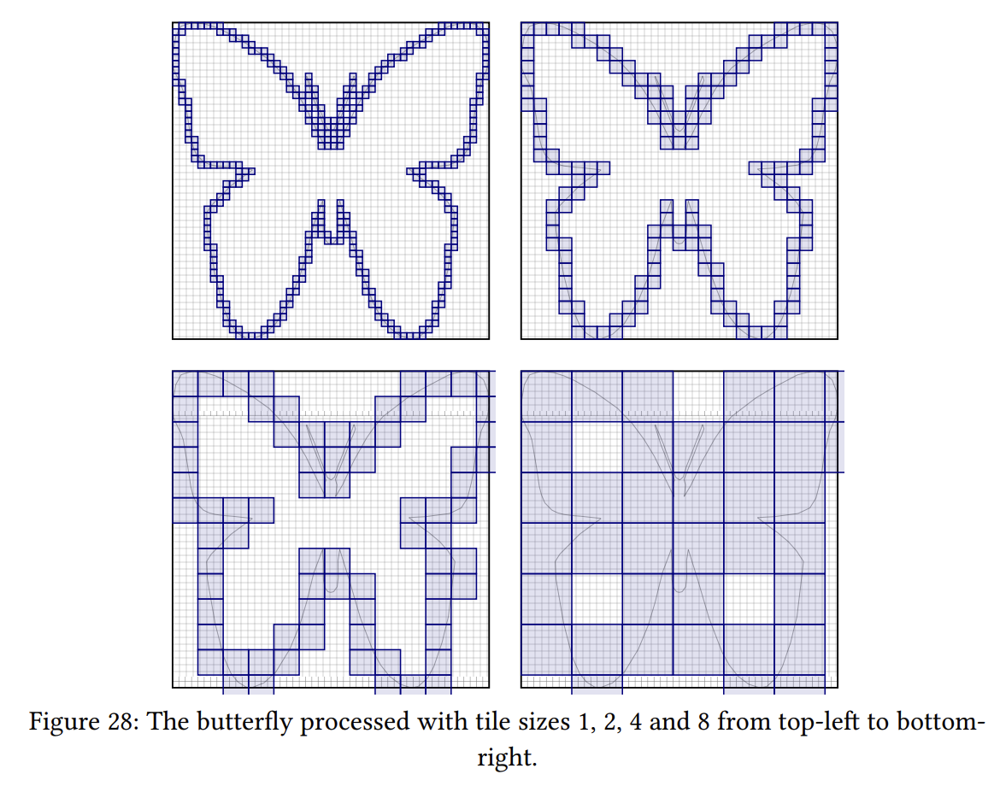

+++
title = "Linebender in October 2025"
authors = ["Raph Levien"]
+++
Linebender is an informal open-source organization working on various projects to advance the state of the art in GUI for [the Rust programming language](https://rust-lang.org).

October saw steady progress on our core crates, including a number of releases.

## Vello

Vello is our GPU vector renderer.
It can draw large 2D scenes with high performance, using GPU compute shaders for most of the work.

Laurenz Stampl has done his Masters degree at ETH Zurich on high performance CPU rendering of 2D graphics, particularly the techniques used in vello_cpu.
The [masters thesis] is now published.
It contains up-to-date background on 2D rendering, which is not well represented in the literature, as well as an explanation of the sparse strip method, and benchmarks.

<figure>

<!--  -->

<figcaption>

An illustration from Laurenz Stampfl's Masters Thesis, showing the effect of tile size on rendering efficiency.

</figcaption>
</figure>

We released version [0.0.4 of the sparse strips][sparse strips 0.0.4] versions of the renderer.
It should be a solid version of vello_cpu, suitable for a wider range of applications where CPU-only rendering is appropriate.
In addition, it is the initial release of vello_hybrid, a newer approach that uses the GPU to do pixel compositing, but SIMD-accelerated geometry processing on the CPU.

Thomas Smith has been making excellent progress on rendering sparse strip alpha values in GPU compute shaders.
This was the original motivation for the sparse strip work.
You can follow the progress in the Zulip thread [Thoughts on GPU sparse strips].

Work on Vello Classic focused on support for web standard compatibility, motivated by Servo integration.
Those features include support for non-premultiplied alpha ([vello#1173][], [vello#1262][], [vello#1145][]).

Vello CPU now supports non-isolated blending ([vello#1159][] among others), which is important for HTML5 canvas compatibility.
SVG and COLRv1 emoji, by contrast, which has set priorities for Vello in the past, only support isolated blending.
There are also promising early results for supporting image filters including blurs.

A major development in Vello Hybrid is support for multiple image atlases ([vello#1252][]), which improves performance for image rendering.

## Masonry and Xilem

Masonry is the widget system developed by Linebender.
It provides a non-opinionated retained widget tree, designed as a base layer for high-level GUI frameworks.

Xilem is our flagship GUI project, inspired by SwiftUI, which uses Masonry for its widgets.
It lets you build user interfaces declaratively by composing lightweight views together, and will diff them to provide minimal updates to a retained layer.

We released [version 0.4][Xilem 0.4.0] of both Masonry and Xilem in October.
This release comprises 7 crates, including xilem_web.
It is the first release to switch over to the new HarfRust library, developed by Google Fonts, for shaping, replacing Swash.

## Parley

Parley is a text layout library.
It handles text layout, mostly at the level of line breaking and resolving glyph positions.

We released version [0.6 of Parley][parley 0.6.0].

Slint has moved from their hand-rolled text implementation to Parley, and released version [1.14][Slint 1.14].
Linebender is thrilled to have other UI toolkits in the ecosystem adopt our crates.

Much of the development work on Parley is directed toward supporting HTML floats, particularly in Blitz.
[parley#421][] is the main PR tracking this work, and references several other PRs.

There has also been some performance work, which especially impacts larger paragraphs.
This work continues, and we hope to publish quantitative benchmark results in November.

We're also in the process of migrating to ICU4X for Unicode primitives, replacing our own hand-rolled implementations ([parley#436][]).
This change should improve maintainability.

## Fearless SIMD

Fearless SIMD is our SIMD infrastructure library.
It provides a solid way for writing SIMD operations portably across WASM, Aarch64, x86, and x86_64.

We released [Fearless SIMD 0.3] in October.
This release contains improvements in integer operations, particularly variable sized shifting, and better native support for fused multiply-add and multiply-subtract.

As development work, we are pursuing a new approach to using intrinsics safely inside `#[target_feature]` blocks: [fearless_simd#108].
[Safe SIMD intrinsics](https://blog.rust-lang.org/2025/05/15/Rust-1.87.0/#safe-architecture-intrinsics) were added in Rust 1.87, and we encourage using them when writing architecture-specific code.
An explicit design goal of fearless_simd is to allow portable code in cases where the functionality is reasonably common across architectures, but also facilitate "downcasting" to a specific SIMD level when those intrinsics offer higher performance than the portable choice.
For more details on downcasting, see the [A plan for SIMD] blog post.

## Get Involved

We welcome collaboration on any of our crates.
This can include improving the documentation, implementing new features, improving our test coverage, or using them within your own code.

We host an hour long office hours meeting each week where we discuss what's going on in our projects.
See [#office hours in Zulip](https://xi.zulipchat.com/#narrow/channel/359642-office-hours) for details.
We're also running a separate office hours time dedicated to the renderer collaboration, details also available at that link.

If you wish to discuss the Linebender project individually, Daniel is offering ["office hours" appointments](https://calendar.google.com/calendar/u/0/appointments/schedules/AcZssZ32eQYJ9DtZ_wJaYNtT36YioETiloZDIdImFpBFRo5-XsqGzpikgkg47LPsiHhpiwiQ1orOwwW2), which are free to book.
It really helps us to learn what aspects our users care about the most.

[Xilem 0.4.0]: https://github.com/linebender/xilem/releases/tag/v0.4.0

[sparse strips 0.0.4]: https://github.com/linebender/vello/releases/tag/sparse-strips-v0.0.4

[parley 0.6.0]: https://github.com/linebender/parley/releases/tag/v0.6.0

[Fearless SIMD 0.3]: https://github.com/linebender/fearless_simd/releases/tag/v0.3.0

[Slint 1.14]: https://slint.dev/blog/slint-1.14-released
[masters thesis]: https://ethz.ch/content/dam/ethz/special-interest/infk/inst-pls/plf-dam/documents/StudentProjects/MasterTheses/2025-Laurenz-Thesis.pdf
[Thoughts on GPU sparse strips]: https://xi.zulipchat.com/#narrow/channel/197075-vello/topic/Thoughts.20on.20GPU.20sparse.20strips/near/543334092

[parley#436]: https://github.com/linebender/parley/pull/436

[vello#1173]: https://github.com/linebender/vello/pull/1173
[vello#1262]: https://github.com/linebender/vello/pull/1262
[vello#1145]: https://github.com/linebender/vello/pull/1145
[vello#1159]: https://github.com/linebender/vello/pull/1159
[vello#1252]: https://github.com/linebender/vello/pull/1252

[fearless_simd#108]: https://github.com/linebender/fearless_simd/pull/108

[A plan for SIMD]: https://linebender.org/blog/a-plan-for-simd/
