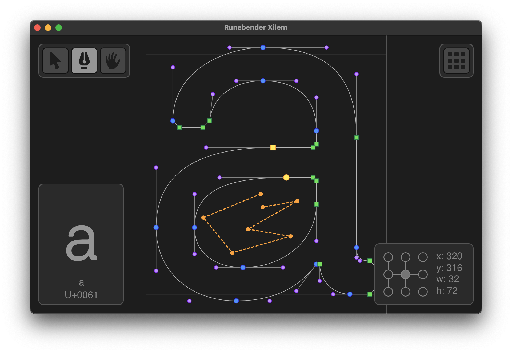

+++
title = "Linebender in November 2025"
authors = ["Kaur Kuut", "Robert Brewitz Borg"]
+++

Linebender is an informal open-source organization working on various projects to advance the state of the art in GUI for [the Rust programming language](https://rust-lang.org).

## Vello

Vello is our GPU vector renderer.
It can draw large 2D scenes with high performance, using GPU compute shaders for most of the work.

- [vello#1203][]: Introduced a new clipping algorithm for non-layer based clipping.
- [vello#1286][]: Added image filters to Vello CPU.
- [vello#1301][]: Optimized gradient rendering in Vello CPU.
- [vello#1237][]: Added support for non-isolated masks.
- [vello#1309][]: Added comprehensive examples to Vello CPU.

<figure>

<figcaption>
Vello CPU now has Gaussian Blur, Drop Shadow, and Flood effects.
</figcaption>
</figure>

## Masonry and Xilem

Masonry is the widget system developed by Linebender.
It provides a non-opinionated retained widget tree, designed as a base layer for high-level GUI frameworks.

Xilem is our flagship GUI project, inspired by SwiftUI, which uses Masonry for its widgets.
It lets you build user interfaces declaratively by composing lightweight views together, and will diff them to provide minimal updates to a retained layer.

- [xilem#1443][]: Added text size config to `Checkbox` and `TextInput`.
- [xilem#1444][]: Added support for non-contiguous app state.
- [xilem#1448][]: Changed default background and text colors.
- [xilem#1461][]: Refactored `xilem_core` module structure.
- [xilem#1455][]: Reworked `to_do_mvc` example.
- [xilem#1471][]: Lifted common `View` wrappers to `xilem_core`.
- [xilem#1470][]: Renamed `MessageContext` to `MessageCtx`.
- [xilem#1440][]: Added `ResizeObserver` for detecting widget size changes.
- [xilem#1482][]: Added `Passthrough` widget for simple widget encapsulation.
- [xilem#1493][], [xilem#1494][]: Added support for efficient child replacement in all widgets.
- [xilem#1497][], [xilem#1502][]: Standardized widget child management methods.
- [xilem#1492][]: Added `FocusedBorderColor` property.
- [xilem#1505][]: Now accepting `state` in `Task` view.
- [xilem#1499][]: Split off `WindowView` code into `MasonryRoot`.
- [xilem#1490][]: Upgraded to Parley v0.7.0.

Eli Heuer has made significant progress in porting our old Druid hero app, [Runebender][], to Xilem.\
Check out the [port's repo][] or follow the progress on [Zulip][Xilem Runebender Zulip].

<figure>

<figcaption>
Runebender is being ported to Xilem.
</figcaption>
</figure>

## Parley

Parley is a text layout library.
It handles text layout, mostly at the level of line breaking and resolving glyph positions.

We released [Parley 0.7][]. 🎉

- [parley#449][]: Optimized line height computation.
- [parley#367][]: Added `TextWrapMode` style.
- [parley#452][]: Introduced Unicode data in preparation of migrating to ICU4X.
- [parley#468][]: Added word and letter spacing to text layout based on style properties.
- [parley#467][], [parley#471][]: Added `fontconfig-dlopen` feature to Fontique to control how to load the fontconfig library.
- [parley#276][]: Improved trailing whitespace handling.

We have also won not just [one][NLnet-1] but [two][NLnet-2] grants from [NLnet][] for additional work on Parley in 2026.
More updates to follow as we finalize the plans.

## Kurbo

Kurbo provides data structures and algorithms for curves and vector paths.

We released [Kurbo 0.13][]. 🎉

- [kurbo#493][]: Converted `CubicBez::nearest` to the `poly-cool` quintic solver for a nice speedup (3000x for high accuracy!) and better robustness. This just missed the 0.13 release train.
- [kurbo#521][], [kurbo#522][], [kurbo#525][], [kurbo#524][], [kurbo#526][]: Marked a bunch of methods `const`.
- [kurbo#527][]: Derived `Hash` for `Axis`.

## Fearless SIMD

Fearless SIMD is our SIMD infrastructure library.
It provides a solid way for writing SIMD operations portably across WASM, Aarch64, x86, and x86_64.

- [fearless_simd#115][]: Updated x86 codegen to use AVX2 intrinsics.
- [fearless_simd#123][]: Widened AVX2's associated types to 256 bits.
- [fearless_simd#120][]: Implemented the reinterpret operations without `bytemuck`.
- [fearless_simd#130][]: Implemented `core::ops::Not` for integer types.
- [fearless_simd#134][]: All float-to-integer and integer-to-float conversions are implemented properly on x86. They should now handle all values correctly, including `NaN`.
- [fearless_simd#136][]: The floating-point `min_precise` and `max_precise` operations now behave the same way on x86 and WebAssembly as they do on AArch64, returning the non-`NaN` operand if one operand is `NaN` and the other is not.
  Previously, they returned the second operand if either was `NaN`.
- [fearless_simd#140][]: The `load_interleaved` and `store_interleaved` operations now use native intrinsics on x86, instead of using the fallback implementations.
- [fearless_simd#143][]: Now using WebAssembly's relaxed SIMD intrinsics if available.
- [fearless_simd#145][]: Added the `ceil` and `round_ties_even` operations to floating-point vector types.

## Velato

Velato is our Lottie render library.
The goal of this crate is to provide coverage of the large Lottie spec, up to what vello can render, for use in interactive graphics.

- [velato#78][]: Restructure schema to reflect the specification types
- [velato#79][]: Allow any skew value
- [velato#80][]: Replace keyframe with kurbo for tweening because of multiple reasons
- [velato#81][]: Actually tween with a cubic bezier curve
- [velato#82][]: Fixes flickering issues for certain lottie configuration
- [velato#83][]: Adds support for trimmed paths
- [velato#84][]: Fixes matte layers
- [velato#85][]: Just grab the x and y coordinates of the easing handles

An assortment of fixes and improvements to Velato's Lottie support to render more complex animations correctly, see the linked PRs for details.

## Bevy Vello

bevy_vello is our Bevy integration for Vello.
The goal is to provide support for rendering scenes, text, svgs, and lotties in the bevy game engine.

- [bevy_vello#180][]: Update to Bevy 0.17 (plus other dependency updates)
- [bevy_vello#182][]: fix: resize render targets on camera viewport change
- [bevy_vello#184][]: Change bevy version to 0.17 in changelog #184

A lot of work was done to update bevy_vello for bevy 0.17.

## Get Involved

We welcome collaboration on any of our crates.
This can include improving the documentation, implementing new features, improving our test coverage, or using them within your own code.

We host an hour long office hours meeting each week where we discuss what's going on in our projects.
See [#office hours in Zulip](https://xi.zulipchat.com/#narrow/channel/359642-office-hours) for details.
We're also running a separate office hours time dedicated to the renderer collaboration, details also available at that link.

If you wish to discuss the Linebender project individually, Daniel is offering ["office hours" appointments](https://calendar.google.com/calendar/u/0/appointments/schedules/AcZssZ32eQYJ9DtZ_wJaYNtT36YioETiloZDIdImFpBFRo5-XsqGzpikgkg47LPsiHhpiwiQ1orOwwW2), which are free to book.
It really helps us to learn what aspects our users care about the most.

[vello#1203]: https://github.com/linebender/vello/pull/1203
[vello#1286]: https://github.com/linebender/vello/pull/1286
[vello#1301]: https://github.com/linebender/vello/pull/1301
[vello#1237]: https://github.com/linebender/vello/pull/1237
[vello#1309]: https://github.com/linebender/vello/pull/1309

[xilem#1443]: https://github.com/linebender/xilem/pull/1443
[xilem#1444]: https://github.com/linebender/xilem/pull/1444
[xilem#1448]: https://github.com/linebender/xilem/pull/1448
[xilem#1461]: https://github.com/linebender/xilem/pull/1461
[xilem#1455]: https://github.com/linebender/xilem/pull/1455
[xilem#1471]: https://github.com/linebender/xilem/pull/1471
[xilem#1470]: https://github.com/linebender/xilem/pull/1470
[xilem#1440]: https://github.com/linebender/xilem/pull/1440
[xilem#1482]: https://github.com/linebender/xilem/pull/1482
[xilem#1493]: https://github.com/linebender/xilem/pull/1493
[xilem#1494]: https://github.com/linebender/xilem/pull/1494
[xilem#1497]: https://github.com/linebender/xilem/pull/1497
[xilem#1502]: https://github.com/linebender/xilem/pull/1502
[xilem#1492]: https://github.com/linebender/xilem/pull/1492
[xilem#1505]: https://github.com/linebender/xilem/pull/1505
[xilem#1499]: https://github.com/linebender/xilem/pull/1499
[xilem#1490]: https://github.com/linebender/xilem/pull/1490
[Runebender]: https://github.com/linebender/runebender
[port's repo]: https://github.com/eliheuer/runebender-xilem
[Xilem Runebender Zulip]: https://xi.zulipchat.com/#narrow/channel/197829-runebender/topic/Runebender.20Xilem/with/560954771

[Parley 0.7]: https://github.com/linebender/parley/releases/tag/v0.7.0
[parley#449]: https://github.com/linebender/parley/pull/449
[parley#367]: https://github.com/linebender/parley/pull/367
[parley#452]: https://github.com/linebender/parley/pull/452
[parley#468]: https://github.com/linebender/parley/pull/468
[parley#467]: https://github.com/linebender/parley/pull/467
[parley#471]: https://github.com/linebender/parley/pull/471
[parley#276]: https://github.com/linebender/parley/pull/276
[NLnet-1]: https://nlnet.nl/project/Parley/
[NLnet-2]: https://nlnet.nl/project/Parley-copypaste/
[NLnet]: https://nlnet.nl/

[Kurbo 0.13]: https://github.com/linebender/kurbo/releases/tag/v0.13.0
[kurbo#493]: https://github.com/linebender/kurbo/pull/493
[kurbo#521]: https://github.com/linebender/kurbo/pull/521
[kurbo#522]: https://github.com/linebender/kurbo/pull/522
[kurbo#525]: https://github.com/linebender/kurbo/pull/525
[kurbo#524]: https://github.com/linebender/kurbo/pull/524
[kurbo#526]: https://github.com/linebender/kurbo/pull/526
[kurbo#527]: https://github.com/linebender/kurbo/pull/527

[fearless_simd#115]: https://github.com/linebender/fearless_simd/pull/115
[fearless_simd#123]: https://github.com/linebender/fearless_simd/pull/123
[fearless_simd#120]: https://github.com/linebender/fearless_simd/pull/120
[fearless_simd#130]: https://github.com/linebender/fearless_simd/pull/130
[fearless_simd#134]: https://github.com/linebender/fearless_simd/pull/134
[fearless_simd#136]: https://github.com/linebender/fearless_simd/pull/136
[fearless_simd#140]: https://github.com/linebender/fearless_simd/pull/140
[fearless_simd#143]: https://github.com/linebender/fearless_simd/pull/143
[fearless_simd#145]: https://github.com/linebender/fearless_simd/pull/145
[velato#78]: https://github.com/linebender/velato/pull/78
[velato#79]: https://github.com/linebender/velato/pull/79
[velato#80]: https://github.com/linebender/velato/pull/80
[velato#81]: https://github.com/linebender/velato/pull/81
[velato#82]: https://github.com/linebender/velato/pull/82
[velato#83]: https://github.com/linebender/velato/pull/83
[velato#84]: https://github.com/linebender/velato/pull/82
[velato#85]: https://github.com/linebender/velato/pull/85
[bevy_vello#180]: https://github.com/linebender/bevy_vello/pull/180
[bevy_vello#182]: https://github.com/linebender/bevy_vello/pull/182
[bevy_vello#184]: https://github.com/linebender/bevy_vello/pull/184
