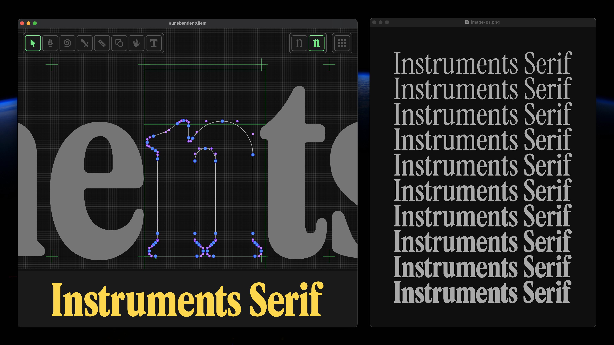
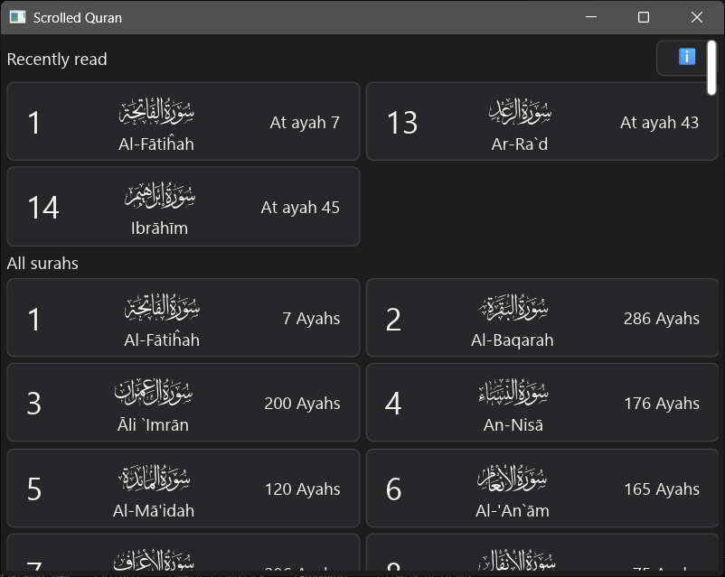
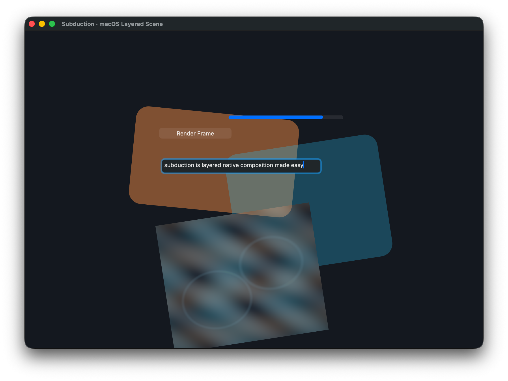

+++
title = "Linebender in 2026 Q1"
authors = ["Raph Levien"]
+++

Apologies for the delay in the update, as the past three months have been a hectic time.
Two of the core Linebender team members, myself and Daniel McNab, have moved across the world and started full-time jobs at Canva.
Getting onboarded has taken a lot of time and energy, but fortunately, work on Linebender crates remains a core part of our responsibilities.
And in the meantime, the community has been pushing forward.

## Vello

We've made big improvements to Vello Hybrid, both in capabilities and in performance.

Several releases, most recently [sparse strips 0.0.7](https://github.com/linebender/vello/releases/tag/sparse-strips-v0.0.7) (encompassing both Vello CPU and Vello Hybrid) and [Vello 0.8.0](https://github.com/linebender/vello/releases/tag/v0.8.0).

Optimizations:
 * Fast paths to bypass full coarse rasterization.
 * Special case drawing rectangles (as opposed to general Bézier paths)
 * First cut at glyph caching – more work is needed.
 * TODO fill out more

Vello Hybrid is currently at roughly beta quality; there are some rough edges still and performance work to be done, but it should be usable.

While we were hoping for a project called Vello API to provide a unified, low level API encompassing both Vello CPU and Vello Hybrid, we ran into more complexity and difficulty than intended.
There are two abstraction layers that can be used for a variety of renderers, both Vello and other renderers including Skia.
 * [AnyRender], which is part of Blitz.
 * [imaging], which is part of the forest-rs organization.

These two crates are fairly similar in scope, but with different emphasis.
AnyRender prioritizes ergonomics, in general closely following the traditional canvas API, while imaging is focused on performance and a more complete set of operations.

### Glifo

Until recently, all three manifestations of Vello each had their own copy of code to extract font outlines and render them.
For ordinary fonts, this isn't a lot of logic on top of Skrifa.
But for color emoji, it's more complicated and involves wiring up a lot more of the imaging model.
We've also been finding scope for more operations at the layer between simple rendering and low-level font parsing, including ink skipping for underlines.
To handle these functions, we created a crate called "parley_draw" inside the Parley repo, but that wasn't the right name or the right place for it, as these functions aren't really related to text layout.
The crate has now been renamed to "Glifo," and has moved into the Vello repo.
The new location is to reduce the friction to iterate on the implementation of atlas-based glyph caching.

For a more recent discussion of the scope and goals of Glifo, see the thread [#vello > Glifo: A separation of concerns](https://xi.zulipchat.com/#narrow/channel/197075-vello/topic/Glifo.3A.20A.20separation.20of.20concerns/with/584192738).

In the longer term, we would like to see Glifo become independent of Vello rendering and be adopted by other projects in the ecosystem, but for the time being it should be considered in development.

## Parley

Parley has seen slow but steady improvements in features, including:

 * [parley#536] enumerate system fonts on mac using CoreText
 * [parley#540] Load fonts from system, and provided paths
 * [parley#551] CSS text-indent support
 * [parley#563] Implement all possible AccessKit text properties

Bevy has switched to Parley ([Zulip thread](https://xi.zulipchat.com/#narrow/channel/205635-parley/topic/Bevy.20now.20uses.20Parley.2FFontique.20for.20text/with/578693539)).

CuTTY is a fork of Alacritty (a high performance terminal emulator) that has been ported to Vello and Parley ([Zulip thread](https://xi.zulipchat.com/#narrow/channel/205635-parley/topic/I.20forked.20and.20migrated.20Alacritty.20to.20Vello.2BParley/with/580875316)).

Other projects which now use Parley but have not previously been mentioned are:
 * [Gosub engine](https://gosub.io/) (browser engine)
 * [drafft-ink](https://github.com/PatWie/drafft-ink) (infinite canvas whiteboard)
 * [Takumi] (renders HTML/JSX/etc into images)

It's gratifying to see all this adoption.
It seems like recognition that Parley is a viable text layout library for a broad range of applications.

## Xilem and Masonry

Masonry has moved to [imaging] as an abstraction over the 2D rendering engine ([xilem#1696]).
Previously it had been hardcoded to use Vello classic.
Because imaging supports a wide variety of back-ends, Masonry can now operate in a wider variety of environments, including Vello CPU for rendering not requiring a GPU.

Masonry has bunch of new widgets, including Svg, Divider, CollapsePanel, StepInput, RadioButtons, Switch, Clip, Split.

Masonry now has a new layout system ([xilem#1560]).

Masonry is using `ui-events` for more of the integration with system capabilities, including IME (input method editing).
This reduces the dependency on winit, and opens the door to deployments not dependent on winit.
In the [#masonry > Embeddable GUI backend](https://xi.zulipchat.com/#narrow/channel/317477-masonry/topic/Embeddable.20GUI.20backend.2E/with/582566308) Zulip thread, there is discussion of embedding Masonry in a VST plugin, using baseview instead of winit.

<!-- Should we mention that work on Placehero has stalled out now that it's no longer funded?-->

We're seeing some cool Xilem apps in the ecosystem, including a port of Runebender to Xilem ([Zulip thread](https://xi.zulipchat.com/#narrow/channel/197829-runebender/topic/Runebender.20Xilem/with/574012987)).
That's especially gratifying to see, as it was the "hero app" for Druid for several years.

<figure>

<figcaption>
A screenshot of Runebender Xilem.
</figcaption>
</figure>

We've also gotten word of Boomaga-IPP, a refresh of a virtual printer project ([Zulip thread](https://xi.zulipchat.com/#narrow/channel/354396-xilem/topic/Boomaga-IPP.3A.20A.20new.20app.20using.20XILEM/with/576938266)).

Another interesting app is [Scrolled Quran] by Muhammad Ragib Hasin.

<figure>

<figcaption>
A screenshot of Scrolled Quran.
</figcaption>
</figure>

## Related ecosystem projects

There's a lot of interesting activity surrounding Linebender, including projects that use Linebender crates, and adjacent bits of infrastructure.

### Subduction

It's long been clear there is value in more fully exploiting system compositor capabilities, but it's a hard problem and Linebender projects have so far just been using plain windows and swapchains.
I've had a blog post stuck in rough draft for over four years — [How to think about the compositor in 2022](https://github.com/raphlinus/raphlinus.github.io/issues/77).
Compositor integration is needed for efficient video playback, and is also the best way to stitch native widgets into a GPU-accelerated rendering surface.
Bruce Mitchener got tired of waiting and has started the [subduction](https://github.com/forest-rs/subduction) crate, with compelling examples.
To learn more, see the [Subduction: System compositor integration](https://xi.zulipchat.com/#narrow/channel/197075-vello/topic/Subduction.3A.20System.20compositor.20integration/with/582293122) Zulip thread.

<!-- TODO: better screenshot? The web one may be visually more interesting -->
<figure>

<figcaption>
A screenshot of the subduction sample app.
There are AppKit widgets including text editing, a wgpu surface running shaders, and other layers.
</figcaption>
</figure>

## RustWeek

There are two talks from Linebender affiliated people: Nico Burns' [talk on Blitz](https://2026.rustweek.org/talks/nico/), and Taj Pereira and Alex Jakubowicz' [talk on WASM](https://2026.rustweek.org/talks/wasm/).
In addition, Linebender is one of the [Unconference](https://2026.rustweek.org/unconf-intro/) tracks.
If you are interested in participating in the latter, reach out to me, as I'm the designated community leader.

## Get Involved

We welcome collaboration on any of our crates.
This can include improving the documentation, implementing new features, improving our test coverage, or using them within your own code.

We host an hour long office hours meeting each week where we discuss what's going on in our projects.
See [#office hours in Zulip](https://xi.zulipchat.com/#narrow/channel/359642-office-hours) for details.
We're also running a separate office hours time dedicated to the renderer collaboration, details also available at that link.
Note that office hours are on a break for the remainder of the year.
They are expected to continue in January, keep an eye on Zulip for details.

[xilem#1560]: https://github.com/linebender/xilem/pull/1560
[xilem#1696]: https://github.com/linebender/xilem/pull/1696

[parley#536]: https://github.com/linebender/parley/pull/536
[parley#540]: https://github.com/linebender/parley/pull/540
[parley#551]: https://github.com/linebender/parley/pull/551
[parley#563]: https://github.com/linebender/parley/pull/563

[Scrolled Quran]: https://github.com/RagibHasin/scrolled-quran

[imaging]: https://github.com/forest-rs/imaging
[AnyRender]: https://github.com/dioxuslabs/anyrender

[Gosub engine]: https://gosub.io/
[drafft-ink]: https://github.com/PatWie/drafft-ink
[Takumi]: https://github.com/kane50613/takumi
