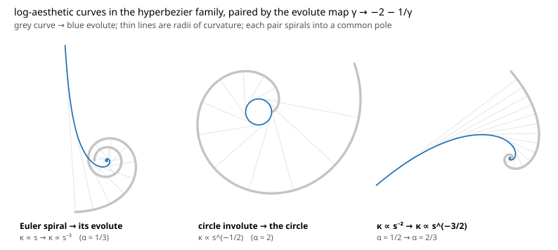
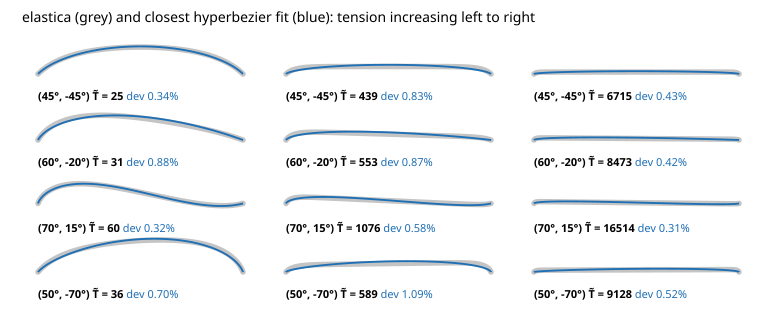

+++
title =  "The mathematical beauty of hyperbezier curves"
authors = ["Raph Levien"]
+++
I have for many decades been fascinated by the prospect of a curve family better suited for interactive design than cubic Béziers.
In that search, I have come to a new-found respect for those Béziers.
In particular, though other curves like Euler spirals are better at representing smooth curves, they fall short at representing regions large curvature variation, where cubic Béziers excel.
The great strength of Béziers is their versatility.

So, to find a strictly better curve family, one requirement is clear: the family should contain both smooth curvature variation and higher-tension regions where curvature peaks.
Polynomial spirals, or Spiro curves, the subject of my [PhD thesis], fail to achieve this goal.

After considerable search and rejecting a number of candidates, I now bring a proposal for a curve family which I think is a very strong candidate for supplanting cubic Béziers in 2D vector graphic design.

Without further ado, the curve family is represented by the Cesàro equation, specifying curvature as a function of arc length:

$$\kappa(s) = \frac{as+b}{(cs^2+ds+1)^{1.5}}$$

This curve behaves surprisingly similarly to a cubic Bézier, especially at smaller angles, but when pushed has very different behavior.
Overall it has smoother curvature variation and is more likely to have monotonic curvature.
It contains within it a few valuable analytic curves, and is also good at approximating a wide range of others.
The remainder of this blog post is devoted to showing its behavior in a wide range of contexts.

## Approximation of cubic Béziers

The hyperbezier closely approximates cubic Béziers at low deflection angles at the endpoints.
I will show rather than try to present mathematic reasoning.
Below is an interactive tester that maps cubic Bézier control points to a corresponding hyperbezier.
The Bézier is shown in gray for comparison.

  <canvas id="cv"></canvas>
  

    <h3>options</h3>
    <label><input type="checkbox" id="showCubic" checked> cubic Bézier</label>
    <label><input type="checkbox" id="showComb" checked> curvature comb</label>
    <!--
    <h3>status</h3>
    

    -->
  

At larger angles, and also when the "arm lengths" of the control handles get larger, the fit with the cubic Bézier is not particularly close, but the control scheme is still a useful way of setting the parameters for the hyperbezier curve (setting the polynomial coefficients directly is not at all intuitive).

Note that this parameter mapping is a first usable draft, and may not be the final version.
That said, in an interactive editing context, a perfect mapping is not required, as it's always possible to tweak the control points to reach any desired curve shape.

The details of the mapping can be found in the JavaScript source for this page, but the basic principle is that the arm lengths set the denominator, then the numerator is solved to make the endpoint tangents match.

## Exact analytical curves

The most obvious analytical curve contained in the family is the Euler spiral, which is clearly attained when $c == d == 0$.
The Euler spiral has smooth curvature variation (it is a solution to the Minimum Variation Curve problem) and monotonic curvature.
An exact circular arc is also within the parameter space, simply when $a == 0$ as well.
Cubic Béziers, by comparison, only approximate circular arcs.

There a few other log-aesthetic curves lurking in the parameter space, meaning curvature is simply the arclength raised to a particular power.
Reachable exponents include -3, -2, -1.5, and -0.5 (alternatively, using the convention from the log-aesthetic papers, α can be 1/3, 1/2, 2/3, and 2).
The last of these is the [circle involute], which is interesting because it is its own parallel curve, among other things.
And the first of these is the evolute of the Euler spiral.

## Superellipses and squircles

A cubic Bézier can do superellipses up to a certain point, but does not approach a sharp corner; somewhere before then it starts developing additional inflection points, while a true superellipse or squircle is of course convex.

The hyperbezier can go all the way to a sharp corner, and visually looks pretty close to the superellipse.
It's not incredibly accurate (for moderate exponents like 3, the best cubic Bézier fit is slightly better, in fact), but visually does the right thing.
It's probably best to say that the hyperbezier is a subtly *different* squircle than the superellipse, neither better nor worse.

## Elastica

An important curve family to consider is the [elastica], an idealized thin flexible strip.
The math behind the elastica has hundreds of years of history, but more to the point it is both a smooth curve (it can be characterized as the exact solution to the Minimum Energy Curve problem) and can exhibit large curvature variation when placed under tension.
To my eyes, it's a more pleasing and natural curve, as it's based in physical reality in a way that cubic Béziers aren't.
Ideally we'd be able to approximate it well, and the fact that Spiro curves can't is a strong case against them.
Fortunately, our hyperbezier does reasonably well.
As in the case of the superellipse, it's a fairly decent visual match, though again not a precise approximation.

## Some mathematical properties

This section is a grab-bag of some mathematical properties of the hyperbezier curve.

An appealing property is that the Cesàro equation is easily integrated, yielding a [Whewell equation]:

$$\theta(s) = \frac{a's+b'}{\sqrt{(cs^2+ds+1)}}$$

Here, the parameters in the numerator aren't the same as the Cesàro equation (though they are readily derived), but the quadratic polynomial in the denominator is the same.
Another round of integration (which I believe will be especially useful for curve fitting) also yields simple analytical equations, revealing that a close relation to trig functions.

The derivation of parameters for the Whewell equation follows fairly straightforwardly from the following integral, which has a pleasing symmetry:

$$\int \frac{as+b}{(cs^2 + 1)^{1.5}} ds = \frac{bs-a/c}{\sqrt{cs^2 + 1}} + C$$

Going in the opposite direction, the derivative is also straightforward, yielding a quadratic over the same polynomial in the denominator, this time with an exponent of 2.5.
To compute roots, identifying the curvature extrema, involves merely solving the quadratic.

Because the denominator is positive, there is at most one inflection point, at $s = -b/a$, when it is in range [0, 1].
That clearly signals that it can't accurately approximate *all* cubic Béziers, as those can have two inflection points.
In my experience, instances of cubic Béziers with two inflection points are rarely used in designs (it might be interesting to look at a corpus of vector graphics to quantify this).

I have experimented with other values for the exponent than 1.5.
A value of 1 would be appealingly simple, as it would resemble [Padé approximation], but I found it cannot represent high-tension curves in a numerically stable way.
I also considered an exponent of 2, but the integrals don't come out as cleanly and overall it didn't match cubic Béziers as closely.
Perhaps this is not surprising, as the exponent of 1.5 resembles the equation for curvature of a parametric curve $\mathbf{x}(t)$:

$$\kappa = \frac{\mathbf{x}' \times \mathbf{x}''}{(\mathbf{x}' \cdot \mathbf{x}')^{1.5}}$$

In general, arc length parametrized curves are in many ways more pleasant to work with than general parametric curves; there's a nontrivial calculation to solve the inverse arc problem for Béziers.

## Future work

In this post, I present the curve family to the world.
I welcome and encourage experimentation.
Of course, there is lots to be done to make the mathematical idea into a practical tool.
For one, it should be wired up into a spline.
I expect to follow the ideas in [The hyperbezier pen tool] by Colin Rofls, which was based on an earlier draft of the hyperbezier math.
This earlier draft had some of the desired behavior of the current proposal, but also some flaws, including *not* being able to approximate sharp superellipses, and also not being closed under subdivision.
On the other hand, it had a straightforward solution to the problem of mapping Bézier-like control points to the parameters.

One idea from the above spline that I think is worth preserving is making splines G2 continuous by construction.
Such approaches don't work well with cubic Béziers because there are multiple local minima, creating saddle points in the optimization terrain.

Another promising direction is working out curve fitting.
While I haven't gotten deep into it yet, I expect curve fitting to be fairly straightforward, especially compared with cubic Béziers.
I'm especially interested in fitting touch or pen data.
As usual for this problem, a central part of the challenge is finding good subdivision points.

I hope to land better implementations in the [spline] repository, but make no guarantees how fast that will go.

## Acknowledgements

I've been working on this for years, and have benefited from discussions with many people, including Colin Rofls, Alex Ionuț, Jacob Rus, and Trevor David Black (apologies if I've missed someone; just let me know).
Special credit goes to Muhammad Ragib Hasin, who improved many of the numerical and solving techniques for parameter mapping.
AI assistance was used to refine the current version of parameter mapping and to prepare the visuals for this post.

[Cesàro equation]: https://en.wikipedia.org/wiki/Ces%C3%A0ro_equation
[Whewell equation]: https://en.wikipedia.org/wiki/Whewell_equation
[The hyperbezier pen tool]: https://www.cmyr.net/blog/hyperbezier.html
[spline]: https://github.com/linebender/spline
[Phd thesis]: https://levien.com/phd/thesis.pdf
[Circle involute]: https://en.wikipedia.org/wiki/Involute#Involutes_of_a_circle
[Elastica]: https://en.wikipedia.org/wiki/Elastica_theory
[Padé approximation]: https://en.wikipedia.org/wiki/Pad%C3%A9_approximant
