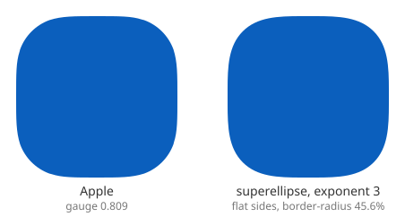

+++
title = "Squircles"
+++

A squircle is a shape intermediate between a square and a circle.
There is no single mathematical definition, rather there are a number of curves that fit this shape.
All general squircles are parametrized, and can vary between circle and square.


<div id="squircle-demo-root">
  <p class="squircle-fallback">Loading the interactive tester…</p>
</div>

<link rel="stylesheet" href="/rust/squircle-demo.css">

<script type="module">
  const root = document.getElementById("squircle-demo-root");
  try {
    const { default: init, start } = await import("/rust/squircle.js");
    await init();
    root.replaceChildren();
    start("squircle-demo-root");
  } catch (err) {
    console.error(err);
    root.replaceChildren(
      Object.assign(document.createElement("p"), {
        className: "squircle-fallback",
        textContent:
          "The interactive tester could not be loaded. It needs JavaScript and WebAssembly.",
      }),
    );
  }
</script>

## Superellipse

The best known squircle is the superellipse, popularized by Piet Hein.
Martin Gardner wrote a detailed narrative of its origin in a [Scientific American column](https://archive.org/details/mathematicalcarn00gard/page/240/mode/2up) in 1977.
The text is replicated in [https://piethein.com/superellipse/](https://piethein.com/superellipse/) but that’s missing equations and figures.

The superellipse has the formula $|x|^n + |y|^n = 1$ (we’ll use a unit radius for convenience).
When $n=2$ it is a circle, and it approaches a square asymptotically as $n \rightarrow \infty$.

## Measurement

There is no standard measurement for squircles.
For superellipses, the exponent is the most common parameter.
A good choice is the coordinates of the midpoint of the quadrant, assuming a unit radius; here $x$ and $y$ are equal.
The conversion formula is simple and intuitive: $x = 0.5^{1/n}$.
This measurement is called "gauge" in the interactive demo above, and is the primary parameter; with the exception of some unreachable regions of parameter space, it should be possible to compare different squircle variants with similar gauge.

## Flat-sided squircles

There are two basic approaches to squircle creation.
One is a single analytic curve, where curvature reaches zero at the poles, but is otherwise nonzero.
The other is mixing straight line segments with corners.
A significant advantage of the latter approach is that it can adapt to rectangles of arbitrary aspect ratio without distorting the corner shape.

## The Apple squircle shape

Squircles received renewed attention when Apple changed the icon shape from rounded rectangle to their own squircle in iOS 7 in 2013.
There were several blog posts to analyze and recreate the shape.
An early analysis suggested that it was a superellipse of exponent 5, but when people extracted the Béziers and looked more closely, that was found to be inaccurate.
Rather, it’s a flat-sided squircle.

For the raw Bézier path data of the Apple shape, the best source is the [PaintCode blog](https://www.paintcodeapp.com/blogpost/code-for-ios-7-rounded-rectangles).
This blog correctly points out some bugs in that logic, and also has some details on behavior for oval rather than square aspect ratios.

The Apple shape has a number of flaws, including one extraneous straight line segment, and a lack of symmetry.
However, those flaws are minor, and really only reveal themselves under close analysis.

The Apple shape has no additional parameter, so its variation is controlled entirely by the length of the flat side.
With no flat side, it has a gauge fixed at 0.809.

An extremely detailed analysis of the Apple shape is in [The Art of Continuous Corners].

## The Figma squircle

Figma published a blog post, [Desperately Seeking Squircles](https://www.figma.com/blog/desperately-seeking-squircles/), with an analysis of the Apple squircle and their own approximation.
It is influential because Figma is an important design tool, because their writeup was compelling, and because there are any number of open source implementations of it, mostly TypeScript/JavaScript.

 * [squircle-path-kit] from msurguy
 * [figma-squircle](https://github.com/phamfoo/figma-squircle) from phamfoo
   + [corner-smoothing](https://github.com/sanalabs/corner-smoothing) from sanalabs (uses figma-squircle)
   + [squircle-js](https://github.com/bring-shrubbery/squircle-js) from bring-shrubbery (uses figma-squircle)
 * [figma_squircle](https://github.com/aloisdeniel/figma_squircle) from aloisdeniel (Dart/Flutter)
 * [Lisse](https://github.com/JaceThings/Lisse) from JaceThings

The Figma blog contains a plot of the Béziers comprising a cleaned up version of iOS 7 rounded rectangle, revealing three Bézier segments per quadrant.
It fixes the straight-line segment and the asymmetry, so is not an exact match.
The middle segment is very close to an arc.
The other segments are more problematic.
They have zero curvature at the endpoints, so are G2 continuous with flat sides, but there is a curvature discontinuity with the middle (arc) section, and their curvature profile is not especially smooth.
A reasonable guess is that it was drawn by hand to be approximately smooth.

Without a flat side, the Figma squircle is only capable of a gauge between $\sqrt{0.5}$ (0.707) and 0.854.
Gauges up to 1 are of course attainable by adding the flat side.

## Clothoid squircles

The Figma blog suggests “smoothed curvature profiles” which have a piecewise linear relationship between arc length and curvature.
It then goes on to approximate them with cubic Bézier segments, but their approximation has fairly significant curvature discontinuities when joining to the circular arc.
The clothoid squircle is worth describing explicitly, as it has G2 continuity (as opposed to G1 for the Figma approximation).

The behavior is generally similar to the Figma variant.
Without a flat side, it is only capable of a gauge between $\sqrt{0.5}$ (0.707) and 0.790.

## The box decorations corner-shape spec

Squircles got a big boost as they’re now standardized in CSS, as the [corner-shape](https://www.w3.org/TR/css-borders-4/#propdef-corner-shape) property of the [box decorations spec].
These specify real superellipse corners, with additional tweaks and support for animation.

### The Chromium superellipse approximation

While the CSS spec mandates the actual superellipse shape, practical implementations will generally use a Bézier approximation.
A blog post, [The corner cases of implementing CSS corner-shape in Blink](https://developer.chrome.com/blog/implementing-corner-shape), gives an efficient closed-form approximation, with two Bézier segments per quadrant.
This formula, determined using symbolic regression, is parametrized, and handles exponents 2 and above well.
It is exact for placing the midpoint (this is part of the formula), so is well calibrated in that regard.

### Apple-like behavior with the corner-shape spec

The early analysis of the Apple squircle shape as being approximately an exponent 5 superellipse was based on coarse shape only and didn't take into account its flat side.
A much better match to the Apple shape is attainable using a superellipse with exponent 3 and a corresponding flat side length to match the gauge.
This has G2 continuity and a similar curvature profile.
This illustration was made using the Chromium approximation, so it should match the browser.



Here's the CSS to accomplish the "close to Apple" squircle shape.
Note that the parameter to the `superellipse()` function is the base-2 log of the exponent, so the value for an exponent of 3 is 1.585.

```css
.icon {
  aspect-ratio: 1;
  border-radius: 46.2%;
  corner-shape: superellipse(1.585);
}
```

## Continuity

A superellipse of exponent $n$ has continuity $G(\lceil n \rceil - 1)$.
This includes the flat-sided variants, as, for exponent > 2, the endpoint of the quadrant has zero curvature.
A perfect circle (and indeed, any even integer exponent) without flat sides is of course the exception, as it has an infinitely high order of continuity.

As a general observation, for visual smoothness, the shape should have G2 continuity.
Of the variants discussed, only the clothoid and superellipse (for n > 2) have this property.
The Chromium approximation comes close; it doesn't have zero curvature by construction when joining the flat part, but does at the corner join by symmetry (unlike the Figma approximation, which has an additional arc there).

## Other squircles

Quite a number of other curves can be pressed into service as squircles if need be.

* The polynomial spiral (“spiro”) curve can do a reasonable flat-sided squircle with G2 continuity.
See the “suitcase corners” section of [Raph's thesis], figure 7.2.

* Conic sections (hyperbolas).
These approximate a sharp corner but are only G1 continuous (if flat sided).

* Fernández-Guasti squircle, defined by $x^2 + y^2 - s^2x^2y^2 = 1$.
This is used in engineering but likely not in graphic design.

* The [Wikipedia page on squircles](https://en.wikipedia.org/wiki/Squircle) has a “periodic squircle” which has very similar behavior to the Fernández-Guasti one (they are visually near indistinguishable).

## Discussion questions:

The offset curve of a squircle is not a squircle, but (a) it’s close, and (b) concentric squircles might be visually just as appealing or more so; for example a slightly rounded inner corner might look better than a sharp one if the curvature exceeds the stroke half-width.
This may be a deeper discussion.

The [blurred rounded rectangle approximation](https://raphlinus.github.io/graphics/2020/04/21/blurred-rounded-rects.html) is based on applying shading to a superellipse; each iso-line is in fact a superellipse.

[squircle-path-kit]: https://msurguy.github.io/squircle-path-kit/
[Raph's thesis]: https://levien.com/phd/phd.html
[box decorations spec]: https://www.w3.org/TR/css-borders-4/
[The Art of Continuous Corners]: https://tsuijunxi.github.io/en/2026/06/23/the-art-of-continuous-corners/
